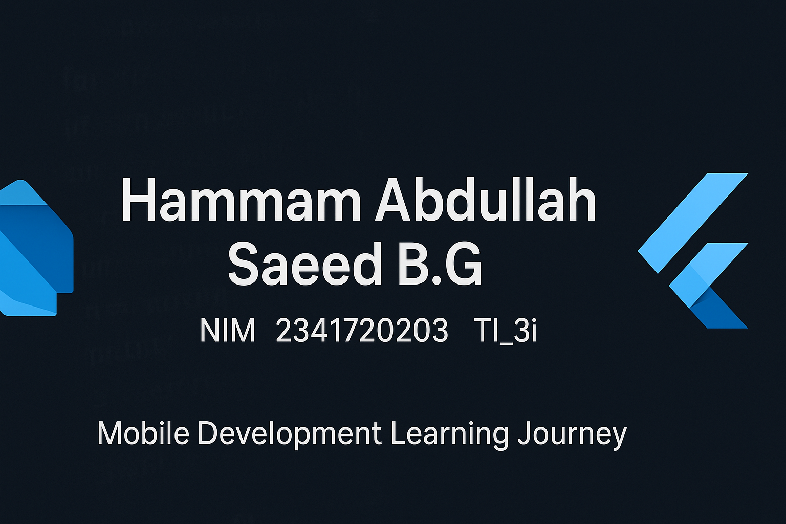

# 📱 Mobile Development Learning Journey  
Welcome to my comprehensive **Mobile Development Learning Repository!**  
This project showcases my continuous learning progress in **Dart programming** and **Flutter framework** as part of my Mobile Application Development course.

---

## 👨‍💻 About  
**Name:** Hammam Abdullah Saeed B.G  
**N.A:** 10  
**NIM:** 2341720203  
**Class:** TI_3I  

---

## 🎯 Learning Objectives  
- Master the fundamentals of **Dart programming**  
- Understand **control flows**, **loops**, and **data structures**  
- Implement **null safety** and **late variables**  
- Develop complete mobile applications using **Flutter**  
- Apply **best practices** in mobile and UI development  

---

## 📚 Course Progress Overview  

### 🔹 Week 1: Introduction to Mobile Development  
**Topics Covered**  
- Overview of Dart and Flutter installation  
- Setting up development environment  
- Understanding project structure  
**Key Learning Outcomes**  
- ✅ Successfully installed and configured Flutter SDK  
- ✅ Understood the purpose of Dart before Flutter  
📖 *Will be updated with more details soon*  

---

### 🔹 Week 2: Dart Programming Fundamentals  
**Topics Covered**  
- Basic Dart syntax and structure  
- Control flow statements (if/else)  
- Loop implementations  
- Null safety and late variables  
**Key Learning Outcomes**  
- ✅ Understood Dart’s syntax and data types  
- ✅ Implemented null safety correctly  
- ✅ Practiced looping and conditional logic  
📖 *View: Week 2 Folder*  

---

### 🔹 Week 3: Advanced Control Flows & Algorithms  
**Topics Covered**  
- Nested if/else and complex logic  
- For, while, and do-while loops  
- Break and continue usage  
- Prime number algorithm  
**Key Learning Outcomes**  
- ✅ Improved logic and loop mastery  
- ✅ Built algorithms using control structures  
📖 *View: Week 3 Folder*  

---

### 🔹 Week 4: Flutter Fundamentals  
**Topics Covered**  
- Introduction to Flutter widgets  
- Stateless vs Stateful widgets  
- Basic layouts (Row, Column, Container)  
**Key Learning Outcomes**  
- ✅ Built first simple Flutter interface  
- ✅ Learned widget structure and tree concept  
📖 *Will be updated soon*  

---

### 🔹 Week 5: Navigation and Routing  
**Topics Covered**  
- Page navigation between widgets  
- Passing data between screens  
**Key Learning Outcomes**  
- ✅ Implemented screen-to-screen navigation  
- ✅ Understood routes and Navigator functions  
📖 *Will be updated soon*  

---

### 🔹 Week 6: Forms and User Input  
**Topics Covered**  
- Creating input fields and buttons  
- Handling user interactions  
- Basic validation  
**Key Learning Outcomes**  
- ✅ Built simple form-based applications  
- ✅ Learned input validation and data handling  
📖 *Will be updated soon*  

---

### 🔹 Week 7: Layout Design and Responsiveness  
**Topics Covered**  
- Flexible layouts (Stack, GridView, ListView)  
- MediaQuery for responsive design  
**Key Learning Outcomes**  
- ✅ Created responsive Flutter UIs  
- ✅ Applied flexible widget layouts  
📖 *Will be updated soon*  

---

### 🔹 Week 8: --- 
**Topics Covered**  
- Understanding stateful behavior  
- setState and data updates  
**Key Learning Outcomes**  
- ✅ Implemented interactive widgets  
- ✅ Managed dynamic app data effectively  
📖 *Will be updated soon*  

---

### 🔹 Week 9:  ---
**Topics Covered**  
- Introduction to Firebase integration  
- Using pub.dev packages  
**Key Learning Outcomes**  
- ✅ Connected Flutter app to Firebase  
- ✅ Learned how to use third-party packages  
📖 *Will be updated soon*  

---

### 🔹 Week 10: ---
**Topics Covered**  
- Combining all previous concepts  
- Developing a complete functional app  
- Debugging, documentation, and testing  
**Key Learning Outcomes**  
- ✅ Built full Flutter application  
- ✅ Demonstrated Dart and Flutter mastery  
📖 *View: Week 10 Folder*  

---

## 🛠️ Technical Skills Developed  

| **Skill Category** | **Technologies & Concepts** |
|---------------------|------------------------------|
| Programming Language | Dart (Null Safety, Late Variables) |
| Framework | Flutter |
| UI Development | Widgets, Layouts, Forms, Navigation |
| Tools | VS Code, Android Studio, Flutter SDK |
| Best Practices | Code Documentation, State Management, Clean Architecture |

---

## 🎨 Project Highlights  

💡 **Featured Implementations**  
- Dynamic Age Calculator – User input with loop logic  
- Prime Number Detector – Efficient algorithm with for-loops  
- Flutter UI Showcase – Multiple screen navigation demo  
- Login Form App – Input validation with clean design  

---

## 📊 Code Quality & Documentation  
- ✅ Organized and readable code structure  
- ✅ Detailed inline explanations  
- ✅ Consistent folder naming for each week  
- ✅ Screenshot documentation for outputs  
- ✅ Practiced debugging and version control  

---

## 🚀 Quick Start  

```bash
# Clone the repository
git clone https://github.com/hemoabdullah/flutter.git

# Navigate to project folder
cd flutter

# Run Dart examples
dart run week2/src/codelab02_dart.dart

# Run Flutter app
flutter run
📁 Repository Structure
bash
Copy code
flutter/
├── 📄 README.md                # Main documentation
├── 📂 week1/                   # Introduction
├── 📂 week2/                   # Dart Fundamentals
├── 📂 week3/                   # Control Flow & Algorithms
├── 📂 week4/                   # Flutter Basics
├── 📂 week5/                   # Navigation
├── 📂 week6/                   # Forms & Input
├── 📂 week7/                   # Layout Design
├── 📂 week8/                   # State Management
├── 📂 week9/                   # Firebase Integration
├── 📂 week10/                  # Final Project
└── 🖼️ Banner.png               # Repository Banner
🏆 Key Achievements
✨ Mastered Dart fundamentals and Flutter essentials
🔄 Built efficient algorithms and responsive UIs
🎨 Created multiple functional Flutter apps
🧩 Gained understanding of state management
📝 Documented progress clearly and consistently

💭 Reflection & Insights
“Learning Dart and Flutter has been a journey of both logic and creativity.
Each week built upon the previous one — from simple syntax to building real-world mobile interfaces. Understanding the basics first made advanced development much smoother.”

🤝 Connect & Collaborate
GitHub: @hemoabdullah
Project: Mobile Development Learning Journey
Institution: [Your Institution Name]
Course: Mobile Application Development

⭐ Thank you for visiting my repository — updates will continue weekly as my learning grows!
