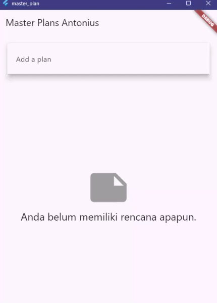

# 📱 Master Plan App

A modern Flutter application for managing multiple to-do lists with state management using InheritedNotifier pattern.

---
#### Hammam Abdullah - 2341720203 
--- 

## 🚀 Features

- **Multiple Plans Management**: Create and organize multiple master plans
- **Task Management**: Add, edit, and check off tasks within each plan
- **State Management**: Efficient state handling using InheritedNotifier and ValueNotifier
- **Progress Tracking**: Real-time task completion tracking
- **Clean Architecture**: Organized code structure with models, providers, and views

---

## 📸 Documentation

### Practical 1: Basic State with Model-View

Users can create tasks via the FloatingActionButton, and these tasks appear in a single plan list.

Everything is maintained within one screen's local state.
When the application restarts, all information disappears since no persistent data management has been set up.
The model and view components haven't been separated yet at this point.


### 2. Explain the purpose of step 4 in the practicum! Why is this done?
This phase establishes the data structure representing an individual task in the master plan, such as learning objectives or action items. Creating this class (like Plan or Task) enables the application to:

Hold both the title and completion status of each plan entry.
Handle the plan collection effectively (including addition, modification, and removal).
Distinguish between data representation (model) and user interface (view), adhering to MVC or MVVM architecture in Flutter.


### 3. Why is the plan variable needed in step 6 of the lab? Why is it a constant?
The plan variable holds the complete collection of Task or Plan objects that make up the user's master plan.

``` dart 
final List<Plan> plan = [];
``` 

This collection stores every plan entry created by users.
It enables the interface to show the plan list and dynamically update their states (marked or unmarked) as users interact with the application.

Why It's Declared as final?

Using final ensures that the list reference itself stays unchanged, though its elements can be modified (like adding or removing entries).

---

### 5. What is the use of the methods in Steps 11 and 13 in the lifecycle state?
initState() serves to retrieve existing plans or set up variables during initialization.
dispose() ensures proper cleanup of the TextEditingController to avoid memory leaks.

---

## Practical 2: InheritedWidget

### Task Summary
Finish all the lab procedures, then include the final output in a GIF format along with a short explanation inside the README.md file.
If you encounter any errors during the process, identify and fix them before submitting.

Explanation of InheritedWidget and InheritedNotifier

#### InheritedWidget
The InheritedWidget is one of Flutter’s essential components that allows data or state to be shared efficiently across the widget tree, without the need to pass values through multiple constructors.
It is often used for basic state management because it lets child widgets listen for updates and rebuild automatically when the provided data changes.
However, a typical InheritedWidget causes all dependent widgets to rebuild whenever the state changes, which can reduce performance when updates occur frequently.

#### InheritedNotifier
The InheritedNotifier is a more advanced form of InheritedWidget that works together with a ChangeNotifier.
It only rebuilds widgets that are actively listening to the notifier, rather than the entire subtree.
This makes it much more efficient for managing rapidly changing data, such as counters, lists, or dynamic input fields.

### Explanation of the Method in Step 3

The method created in step 3 is designed to simplify how widgets access shared data from an InheritedWidget.
Instead of creating multiple instances, the method provides a direct and centralized way to get data through the widget’s BuildContext.

The of(context) method acts like a global accessor that allows widgets within the tree to easily obtain shared information and automatically rebuild when that information changes.
This pattern keeps the code clean and avoids repetitive object creation.

### Step 9 – Output and Explanation

At this stage, a GIF is captured showing the app’s final behavior.
The result demonstrates how the data from the InheritedWidget (or InheritedNotifier) is distributed across the widget tree.
When the shared data changes, only the relevant parts of the interface update automatically, showing the effectiveness of inherited state management in Flutter.
#### Final Result


### Practical 3: State in Multiple Screens
#### Application Demo


1. Complete the lab steps, then document the final results with a GIF and explanation in the file README.md! If you find any errors or issues, please fix them.
2. Based on the Practical 3 that you have done, explain the meaning of the following diagram!
The diagram depicts the widget structure and state management flow in the Master Plan application following the implementation of lifted state using an InheritedWidget (particularly InheritedNotifier), enabling state sharing between multiple screens. This visualization shows how Flutter effectively handles global state across various screens using InheritedNotifier, independent of external state management solutions like Provider or Riverpod.

Main Page (PlanCreatorScreen)

MaterialApp The foundation widget managing themes, navigation, and screen transitions throughout the app.

PlanProvider An InheritedNotifier maintaining global state as a List. Every widget beneath it can retrieve and update the plan collection without explicit data passing through constructors (preventing prop drilling).

PlanCreatorScreen The initial screen showing all available plans and enabling users to create new entries.

Column Stacks widgets in vertical arrangement, containing a TextField and plan collection (Expanded → ListView).

TextField Input component for creating new plans.

Expanded → ListView Shows all current plans. Tapping a plan initiates navigation via Navigator.push() to display the detail screen (PlanScreen).

Navigator Push

The "Navigator Push" connection in the diagram's center indicates screen transitions from PlanCreatorScreen to PlanScreen. The chosen plan information passes through the PlanScreen(plan: plan) constructor.

Plan Detail Page (PlanScreen)

MaterialApp Remains within the identical app framework.

PlanScreen Shows comprehensive information for the chosen plan, including its task collection.

Scaffold Delivers the primary page structure, encompassing AppBar, body, and FloatingActionButton.

Column Organizes content vertically, presenting the task collection and progress overview beneath.

Expanded → ListView Houses the task collection with interactive Checkbox and TextFormField components for checking or modifying tasks.

SafeArea → Text Shows completion metrics (such as "3 out of 5 tasks complete") at the screen bottom.

3. Capture the results of Step 14 as a GIF, then explain what you have created!
### Full Functionality


---
### Architecture Diagram


---

## 🏗️ Project Structure

```
lib/
├── models/
│   ├── data_layer.dart     # Central export file for models
│   ├── plan.dart           # Plan model with completion tracking
│   └── task.dart           # Task model
├── provider/
│   └── plan_provider.dart  # InheritedNotifier provider
├── views/
│   ├── plan_creator_screen.dart  # Main screen for creating plans
│   └── plan_screen.dart          # Task management screen
└── main.dart               # App entry point
```

---

## 🔑 Key Concepts

### 1. Data Layer Architecture

The `data_layer.dart` file centralizes model exports, simplifying imports across the application. Instead of importing multiple model files individually, components can import a single file to access all models.

**Benefits:**
- Cleaner import statements
- Easier maintenance
- Single source of truth for models

### 2. State Management with InheritedNotifier

The `PlanProvider` class extends `InheritedNotifier<ValueNotifier<List<Plan>>>`, providing:

- **Efficient Updates**: Only rebuilds widgets when data changes
- **Tree-wide Access**: Any descendant widget can access shared state
- **Reactive UI**: Automatic UI updates when state changes

**Why InheritedNotifier?**
- Combines InheritedWidget's tree-sharing capability with ValueNotifier's change notification
- More efficient than standard InheritedWidget for mutable state
- Built-in listener management

### 3. Model-Level Business Logic

The `Plan` model includes computed properties:

```dart
int get completedCount => tasks.where((task) => task.complete).length;
String get completenessMessage => 'Completed $completedCount out of ${tasks.length} tasks';
```

**Benefits:**
- Business logic stays in the model layer
- Views remain clean and focused on UI
- Single source of truth for computations

### 4. Widget Lifecycle Management

**`initState()`**: Called once when State object is created
- Used for one-time setup (e.g., initializing ScrollController)
- Perfect for adding listeners

**`dispose()`**: Called when State object is permanently removed
- Critical for cleaning up resources
- Prevents memory leaks by disposing controllers and removing listeners

### 5. Multi-Screen Navigation

The app uses a two-screen architecture:

**PlanCreatorScreen** (Home):
- TextField for creating new plans
- ListView displaying all plans
- Shows empty state when no plans exist

**PlanScreen** (Detail):
- Displays tasks for selected plan
- FloatingActionButton to add new tasks
- Task editing and completion tracking
- Shows progress message at bottom

**State Sharing:**
`PlanProvider` sits above both screens in the widget tree, enabling seamless state sharing during navigation.

---

## 🛠️ Technical Implementation

### Provider Pattern
```dart
PlanProvider(
  notifier: ValueNotifier<List<Plan>>(const []),
  child: MaterialApp(...)
)
```

### ValueListenableBuilder for Reactive UI
```dart
ValueListenableBuilder<List<Plan>>(
  valueListenable: plansNotifier,
  builder: (context, plans, child) {
    // UI updates automatically when plans change
  }
)
```

### Immutable State Updates
```dart
planNotifier.value = List<Plan>.from(planNotifier.value)
  ..[index] = updatedPlan;
```

---


## 🚦 Getting Started

1. Clone the repository
2. Run `flutter pub get`
3. Run `flutter run`
