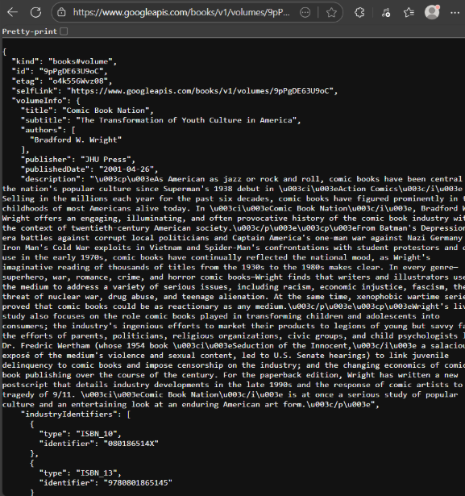
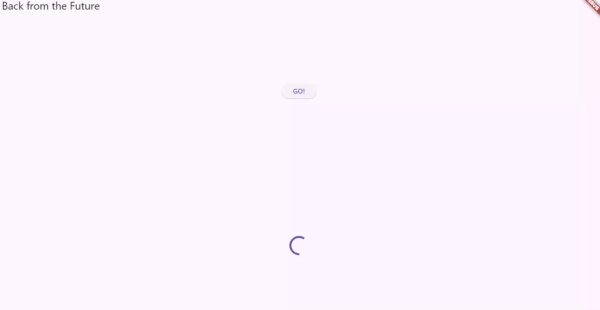
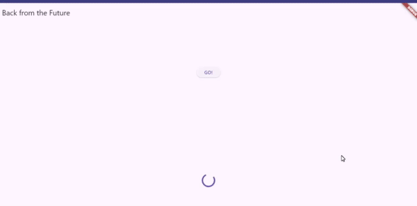
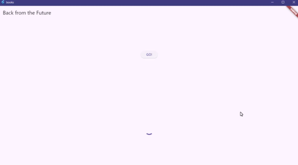
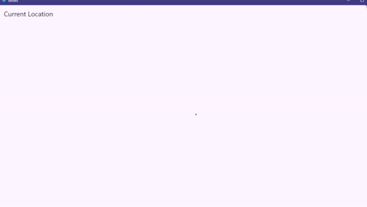
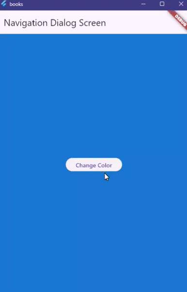
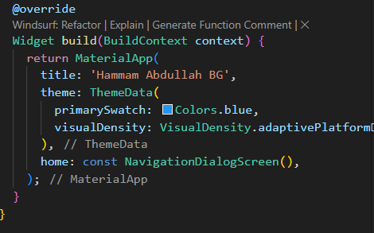
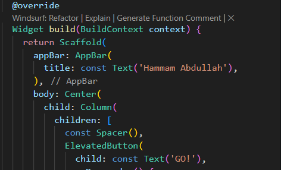
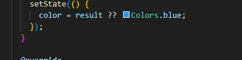

# 📱 Asynchronous Programming in Flutter

## 👤 Hammam Abdullah - 2341720203

---

## 🎯 Complete Android Application Showcase
Devices Used : 
- Chrome web
- Android Emulator 
- samsung phone
### Final Implementation - Android Platform


**Our complete Flutter application running successfully on Android device with all async programming features implemented.**

---

## 📚 Curriculum Structure

### 1. Introduction to Asynchronous Programming
Understanding the fundamentals of non-blocking operations in Flutter and why async programming is essential for responsive mobile applications.

---

## Practicum 1: Downloading Data from Web Service (API)


### HTTP Request Implementation
```dart
Future<Response> getData() async {
  const authority = 'www.googleapis.com';
  const path = '/books/v1/volumes/junbDwAAQBAJ';
  Uri url = Uri.https(authority, path);
  return http.get(url);
}
```

**Learning Objectives:**
- Making HTTP requests to external APIs
- Handling JSON responses from web services
- Understanding network communication in Flutter
- Google Books API integration

---

## Practicum 2: Using await/async to avoid callbacks


### Sequential Async Operations
```dart
Future<int> returnOneAsync() async {
  await Future.delayed(const Duration(seconds: 3));
  return 1;
}

Future<int> returnTwoAsync() async {
  await Future.delayed(const Duration(seconds: 3));
  return 2;
}

Future<int> returnThreeAsync() async {
  await Future.delayed(const Duration(seconds: 3));
  return 3;
}
```

**Key Concepts:**
- Converting callback-based code to async/await
- Sequential execution of async operations
- Avoiding callback hell with modern syntax
- Non-blocking UI operations

---

## Practicum 3: Using Completer in Future


### Manual Future Creation
```dart
late Completer completer;

Future getNumber() {
  completer = Completer<int>();
  calculate();
  return completer.future;
}

Future calculate() async {
  try {
    await Future.delayed(const Duration(seconds: 5));
    completer.complete(42);
  } catch (_) {
    completer.completeError({});
  }
}
```

**Implementation Details:**
- Creating custom Future objects
- Manual completion of Future with Completer
- Error handling in custom Futures
- Understanding Future completion mechanisms

---

## Practicum 4: Calling Future in parallel


### Concurrent Task Processing
```dart
Future returnFG() {
  final futures = Future.wait<int>([
    returnOneAsync(),
    returnTwoAsync(),
    returnThreeAsync(),
  ]);

  futures.then((List<int> value) {
    int total = 0;
    for (var element in value) {
      total += element;
    }
    setState(() {
      result = total.toString();
    });
  });
}
```

**Parallel Processing Features:**
- Using Future.wait() for concurrent execution
- Performance optimization with parallel tasks
- Handling multiple async operations simultaneously
- Aggregating results from parallel Futures

---

## Practicum 5: Handling Error Responses in Async Code


### Robust Exception Management
```dart
Future returnError() async {
  await Future.delayed(const Duration(seconds: 2));
  throw Exception('Something terrible happened');
}

Future handleError() async {
  try {
    await returnError();
  } catch (error) {
    setState(() {
      result = error.toString();
    });
  } finally {
    debugPrint('Complete');
  }
}
```

**Error Management Strategies:**
- Try-catch-finally blocks in async functions
- Graceful error handling and user feedback
- Exception propagation in async calls
- Error state management in UI

---

## Practicum 6: Using Future with StatefulWidget


### State Management with Async Operations
```dart
class FuturePage extends StatefulWidget {
  const FuturePage({super.key});

  @override
  State<FuturePage> createState() => _FuturePageState();
}

class _FuturePageState extends State<FuturePage> {
  String result = '';

  Future<void> performAsyncOperation() async {
    setState(() => result = 'Loading...');
    try {
      final data = await getData();
      setState(() => result = 'Success: ${data.body.length}');
    } catch (e) {
      setState(() => result = 'Error: $e');
    }
  }
}
```

**StatefulWidget Integration:**
- Managing async state in StatefulWidget
- setState() with async operations
- Lifecycle management for async tasks
- UI updates based on async completion

---

## Practicum 7: Managing Future with FutureBuilder


### Reactive UI with FutureBuilder
```dart
FutureBuilder<String>(
  future: getData(),
  builder: (context, snapshot) {
    if (snapshot.connectionState == ConnectionState.waiting) {
      return const CircularProgressIndicator();
    } else if (snapshot.hasError) {
      return Text('Error: ${snapshot.error}');
    } else if (snapshot.hasData) {
      return Text('Data: ${snapshot.data}');
    } else {
      return const Text('No data');
    }
  },
)
```

**FutureBuilder Features:**
- Building UI based on Future state
- Connection state handling (waiting, done, error)
- Automatic UI rebuilding on Future completion
- Eliminating manual setState() for async operations

---

## Practicum 8: Navigation route with Future Function


### Screen Navigation with Data Return
```dart
Future _navigateAndGetColor(BuildContext context) async {
  final result = await Navigator.push(
    context,
    MaterialPageRoute(builder: (context) => const NavigationSecond()),
  );
  
  if (result != null) {
    setState(() {
      color = result;
    });
  }
}
```

**Navigation Techniques:**
- Passing data between screens using Navigator
- Returning results from navigated screens
- Future-based navigation patterns
- Data flow management in navigation

---

## Practicum 9: Utilizing async/await with Widget Dialog


### Enhanced Dialog System with Async Operations
```dart
_showColorDialog(BuildContext context) async {
  await showDialog(
    barrierDismissible: false,
    context: context,
    builder: (_) {
      return AlertDialog(
        title: const Text('Choose Your Color'),
        content: const Text('Select a color theme for your app'),
        actions: <Widget>[
          TextButton(
            child: const Text('Sunset Orange'), 
            onPressed: () {
              color = Colors.deepOrange.shade400; 
              Navigator.pop(context, color);
            },
          ),
          TextButton(
            child: const Text('Ocean Blue'), 
            onPressed: () {
              color = Colors.blue.shade800; 
              Navigator.pop(context, color);
            },
          ),
          TextButton(
            child: const Text('Forest Green'), 
            onPressed: () {
              color = Colors.green.shade700; 
              Navigator.pop(context, color);
            },
          ),
          // ... 7 more color options
        ],
      );
    },
  );
  setState(() {});
}
```

**Advanced Dialog Features:**
- Async dialog interactions with data return
- Multiple choice selection in dialogs
- State updates based on dialog results
- Modern UI with 10 color themes

---

## 🎨 Enhanced UI Components

### Main Application Interface


### Result Display System


### Error State Handling


### Navigation Flow


---

## 🛠️ Technical Implementation

### Project Architecture
```
lib/
├── main.dart                 # App entry point and async demonstrations
├── navigation_dialog.dart    # Enhanced color theme system
├── navigation_first.dart     # Primary navigation screen
├── navigation_second.dart    # Color selection interface
└── geolocation.dart          # Location services implementation
```

### Core Dependencies
```yaml
dependencies:
  flutter:
    sdk: flutter
  geolocator: ^14.0.2         # GPS and location services
  http: ^1.6.0               # HTTP client for API calls

```
### Setup Instructions
```bash
# Navigate to project directory
cd week11

# Install dependencies
flutter pub get

# Run on Android device
flutter run
```
---

## 🎓 Learning Outcomes Achieved

### ✅ Asynchronous Programming Mastery
- **Future Handling**: Complete understanding of Future operations
- **Async/Await**: Modern async programming patterns
- **Error Management**: Robust exception handling strategies
- **Parallel Execution**: Concurrent task processing with Future.wait()

### ✅ UI/UX Development Excellence
- **FutureBuilder**: Reactive UI based on async operations
- **StatefulWidget**: State management with async operations
- **Dialog Systems**: Enhanced user interaction patterns
- **Modern Design**: Card-based layouts with animations

### ✅ Navigation & Architecture
- **Screen Navigation**: Data passing between screens
- **Dialog Navigation**: Modal interactions with results
- **State Communication**: Cross-component data flow
- **Route Management**: Future-based navigation patterns

### ✅ External Service Integration
- **HTTP Communication**: RESTful API integration
- **JSON Parsing**: Data handling from web services
- **Geolocation Services**: GPS and location APIs
- **Permission Management**: Runtime permission handling

---
