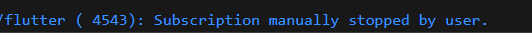
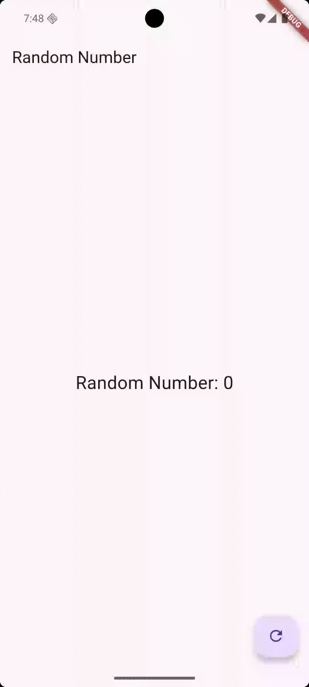

# Week 12 – State, Streams, and BLoC

**Project:** Week 12 Flutter Streams & BLoC

- **Name:** Hammam Abdullah
- **NIM:** 234172023
- **Course:** Mobile Programming – State & Streams

---


# Practicum 1: Dart Streams

## main.dart
```dart
import 'dart:async';
import 'package:flutter/material.dart';
import 'color_stream.dart';

void main() {
  runApp(const MyApp());
}

class MyApp extends StatelessWidget {
  const MyApp({super.key});

  @override
  Widget build(BuildContext context) {
    return MaterialApp(
      title: 'Hammam Abdullah - 234172023',
      theme: ThemeData(
        colorScheme: ColorScheme.fromSeed(
          seedColor: Colors.deepPurple,
          brightness: Brightness.dark,
        ),
        useMaterial3: true,
      ),
      home: const StreamHomePage(),
    );
  }
}

class StreamHomePage extends StatefulWidget {
  const StreamHomePage({super.key});

  @override
  State<StreamHomePage> createState() => _StreamHomePageState();
}

class _StreamHomePageState extends State<StreamHomePage> {
  Color _bgColor = Colors.blueGrey;

  final ColorStream _colorStream = ColorStream();

  @override
  void initState() {
    super.initState();
    _colorStream.getColors().listen((color) {
      setState(() {
        _bgColor = color;
      });
    });
  }

  @override
  Widget build(BuildContext context) {
    return Scaffold(
      appBar: AppBar(
        title: const Text('Hammam Stream Demo'),
        centerTitle: true,
        elevation: 0,
        backgroundColor: Colors.transparent,
      ),
      body: Container(
        color: _bgColor,
      ),
    );
  }
}
```

## color_stream.dart
```dart
import 'package:flutter/material.dart';

class ColorStream {
  Stream<Color> getColors() async* {
    final List<Color> colors = [
      Colors.blueGrey,
      Colors.amber,
      Colors.deepPurple,
      Colors.lightBlue,
      Colors.teal,
      Colors.lightGreen,
      Colors.pink,
      Colors.blueAccent,
      Colors.cyan,
      Colors.purple,
    ];

    yield* Stream.periodic(
      const Duration(seconds: 1),
      (int t) => colors[t % colors.length],
    );
  }
}
```

---

## Question 1
**Answer:**
- **Nickname** added to app title: "Hammam Abdullah - 234172023"
- **App theme colors** changed to `seedColor: Colors.deepPurple` and `brightness: Brightness.dark`
- **Commit** with message "W12: Jawaban Soal 1"

---

## Question 2
**Answer:**
Added 5 additional colors to the `colors` variable:
- `Colors.lightGreen`
- `Colors.pink`
- `Colors.blueAccent`
- `Colors.cyan`
- `Colors.purple`

Total colors now 10 that will change every second.

**Commit** with message "W12: Jawaban Soal 2"

---

## Question 3
**Answer:**
- **Function of `yield*` keyword**: `yield*` in an `async*` function is used to forward all events from another stream directly into the current one. Rather than emitting each value manually, it automatically relays every event produced by the other stream.

- **Meaning of the code**: The code creates a periodic stream that emits a color every 1 second. `Stream.periodic` generates values periodically, and `colors[t % colors.length]` ensures colors are selected cyclically from the available color list.

**Commit** with message "W12: Jawaban Soal 3"


## Question 4
**Answer:**
Application successfully runs and displays background color changes every second.


- **`listen()`**: Uses a callback and lets the program keep running while it reacts to incoming stream events. More suitable for responsive UI because it doesn't block execution.

- **`await for`**: Processes events one by one, pausing for each value in order, similar to iterating through a loop. This will block execution until the stream completes, which is not ideal for interactive UI.

In this implementation, `listen()` is more suitable because it allows the UI to remain responsive while receiving color updates from the stream.

**Commit** with message "W12: Jawaban Soal 5"

---

## Practicum 1 Output


---

## Summary

This practicum successfully demonstrates:
1. Creating and using Streams in Flutter
2. Implementing `yield*` to forward events from another stream
3. Differences between `listen()` and `await for` in handling streams
4. Applying streams for real-time UI updates
5. Managing subscription and stream lifecycle

Streams in Flutter have powerful features for handling async data and can be utilized in real-world scenarios like real-time messaging, file upload/download, user location tracking, working with IoT sensor data, and more.

---


# Practicum 2: Stream Controllers and Sinks

## Updated color_stream.dart (with NumberStream)
```dart
import 'dart:async';
import 'package:flutter/material.dart';

class ColorStream {
  Stream<Color> getColors() async* {
    final List<Color> colors = [
      Colors.blueGrey,
      Colors.amber,
      Colors.deepPurple,
      Colors.lightBlue,
      Colors.teal,
      Colors.lightGreen,
      Colors.pink,
      Colors.blueAccent,
      Colors.cyan,
      Colors.purple,
    ];

    yield* Stream.periodic(
      const Duration(seconds: 1),
      (int t) => colors[t % colors.length],
    );
  }
}

class NumberStream {
  final StreamController<int> _controller = StreamController<int>();

  Stream<int> get stream => _controller.stream;
  Sink<int> get sink => _controller.sink;

  void addNumberToSink(int number) {
    sink.add(number);
  }

  void addError() {
    sink.addError('Something went wrong!');
  }

  void close() {
    _controller.close();
  }
}
```

---

## Question 
**Answer:**
- **Step 8 (initState)**: This method initializes the number stream and sets up a listener that updates the UI whenever a new number is received from the stream. The listener uses `setState()` to update the `lastNumber` variable and trigger a UI rebuild.

- **Step 10 (addRandomNumber)**: This method generates a random number between 0-9 and adds it to the number stream's sink. The sink acts as the input point for the stream, allowing data to be injected into the stream pipeline.

**First Output - Normal Operation:**

---

## Question 
**Answer:**
- **Step 13 (addError method)**: This method in the NumberStream class adds an error to the stream using `sink.addError()`. It demonstrates how streams can handle error conditions by injecting error events into the stream pipeline.

- **Step 14 (onError handler)**: The `onError` callback in the stream listener catches any errors that occur in the stream and handles them by setting `lastNumber` to -1. This shows how to gracefully handle stream errors without crashing the application.

- **Step 15 (Conditional error generation)**: The updated `addRandomNumber()` method now generates random numbers and conditionally adds either a valid number (if < 5) or an error (if ≥ 5) to the stream. This demonstrates how streams can handle both data and error events in the same pipeline.

**Second Output - Error Handling:**


---


# Practicum 3: Stream Transformation

In this practicum, a `StreamTransformer<int, int>` is used to modify the number stream before it reaches the UI.

## Key code / methods

```dart
final transformer = StreamTransformer<int, int>.fromHandlers(
  handleData: (value, sink) {
    sink.add(value * 10); // example transformation
  },
);

numberStream.stream.transform(transformer).listen((event) {
  setState(() {
    lastNumber = event;
  });
});
```

The stream is transformed before reaching the UI, so the widget only displays processed values.

- Numbers from the original stream are mapped (for example, multiplied) inside the transformer.
- Errors can also be converted into special values (such as `-1`) so the UI can display them safely.
- The UI listens to `stream.transform(transformer)` so it only sees the processed output, not the raw data.

**Practicum 3 Output:**


---


# Practical 4 : Managing stream subscriptions

## Question 9

Explain the meaning of the code step 2, 6, and 8:

- **Step 2** initializes the `Stream` by taking the controller's stream and immediately starts listening to incoming events with a `StreamSubscription`. Every new value updates `lastNumber` in the UI so the screen always shows the latest number.

- **Step 6** defines what happens in `dispose()`: the active subscription is cancelled and the stream is closed. This is important to avoid memory leaks and to make sure no more events are processed after the widget is removed.

- **Step 8** updates `addRandomNumber()`. It decides whether to add a normal value (0–4) to the stream or send an error (5–9) and then close the stream. When an error is sent, the `onError` callback sets `lastNumber` to -1, and the `onDone` callback or manual stop logs that no more events will be received.

## Key code / methods

```dart
late StreamSubscription<int> subscription;

subscription = numberStream.stream.listen(
  (value) {
    setState(() {
      lastNumber = value;
    });
  },
  onError: (error) {
    setState(() {
      lastNumber = -1;
    });
  },
  onDone: () {
    debugPrint('Number stream is done');
  },
);

void stopSubscription() {
  subscription.cancel();
}
```

This practicum focuses on controlling the lifetime of the subscription and reacting to `onError` and `onDone`.

**Practicum 4 Output:**




---


# Practical 5 : Multiple stream subscriptions

## Question 10

**Why the error happened**  
The error **"Bad state: Stream has already been listened to"** occurs because a normal (single-subscription) stream in Flutter can only have **one active listener**. In Practicum 5, the same `stream.listen()` is called **twice** on the same stream. When the second listener tries to subscribe, the stream is already being listened to, so Flutter throws this error.  
To fix this, the stream must be converted into a **broadcast stream** using `stream.asBroadcastStream()`, or you must ensure that there is only one subscription.

## Question 11

**Why it shows doubled output**  
After converting the stream to a broadcast stream with `asBroadcastStream()`, the stream can have **multiple independent listeners**. In the code, there are now **two listeners** attached to the same broadcast stream. Every time a new number event is emitted, it is delivered to both listeners, so each value appears twice in the UI. The stream is not generating extra numbers; it simply sends the same event to multiple subscribers, which makes the number sequence look duplicated.

## Key code / methods

```dart
final broadcastStream = numberStream.stream.asBroadcastStream();

broadcastStream.listen((value) {
  debugPrint('Listener 1: $value');
});

broadcastStream.listen((value) {
  debugPrint('Listener 2: $value');
});
```

The same stream becomes shareable by multiple listeners after calling `asBroadcastStream()`.

**Practicum 5 Output:**


---


# Practical 6 : StreamBuilder

## Question 12

**Explain the meaning of the code in steps 3 and 7:**

- **Step 3** defines the number stream in `stream.dart`. It creates a stream that emits an increasing integer value every second using `Stream.periodic`. This stream is the data source that continuously produces new numbers over time.

- **Step 7** uses `StreamBuilder` in the `build()` method to listen to that number stream and rebuild the UI reactively. Every time the stream emits a new value, `StreamBuilder` receives it in `snapshot.data` and rebuilds the text widget, so the displayed number on screen automatically updates without manual `setState()` calls.

## Key code / methods

```dart
Stream<int> numberStream() async* {
  int current = 0;
  while (true) {
    await Future.delayed(const Duration(seconds: 1));
    current++;
    yield current; // new value every second
  }
}

StreamBuilder<int>(
  stream: numberStream(),
  initialData: 0,
  builder: (context, snapshot) {
    return Text('Number: ${snapshot.data}');
  },
);
```

The `StreamBuilder` listens to the number stream and rebuilds the widget tree automatically whenever a new value is emitted.

**Practicum 6 Output:**


---


# Practical 7 : BLoC-Hammam (Random Number BLoC)

## Question 13

**Explain the purpose of this practicum and where the BLoC pattern concept lies.**

- **Purpose:** Implement the basic BLoC (Business Logic Component) pattern in Flutter using `StreamController`, `Stream`, and `StreamBuilder`. The goal is to separate UI from business logic and use a clear event → state flow.

- **Where BLoC lives in the code:**
  - The **UI** (`RandomScreen`) only sends events by pressing the `FloatingActionButton`, which calls `_bloc.generateRandom.add(null)`.
  - The **BLoC** (`RandomNumberBloc` in `random_bloc.dart`) listens to `generateRandomController.stream`, generates a random number with `Random().nextInt(10)`, and pushes the result to `_randomNumberController.sink`.
  - The **UI** listens to the BLoC’s `randomNumber` stream with `StreamBuilder<int>`. Every time a new number is emitted, `StreamBuilder` rebuilds the `Text` widget to show `Random Number: {snapshot.data}`.

This structure keeps all logic inside the BLoC and makes the UI a thin layer that only displays data and sends user events.

## Key code / methods

```dart
class RandomNumberBloc {
  final StreamController<void> generateRandomController = StreamController<void>();
  final StreamController<int> _randomNumberController = StreamController<int>();

  Sink<void> get generateRandom => generateRandomController.sink;
  Stream<int> get randomNumber => _randomNumberController.stream;

  RandomNumberBloc() {
    generateRandomController.stream.listen((_) {
      final random = Random().nextInt(10);
      _randomNumberController.sink.add(random);
    });
  }

  void dispose() {
    generateRandomController.close();
    _randomNumberController.close();
  }
}

// UI side
StreamBuilder<int>(
  stream: _bloc.randomNumber,
  initialData: 0,
  builder: (context, snapshot) {
    return Text('Random Number: ${snapshot.data}');
  },
);
```

The UI sends events to the BLoC, and the BLoC outputs a stream of random numbers that the `StreamBuilder` listens to.

**Practicum 7 Output:**


