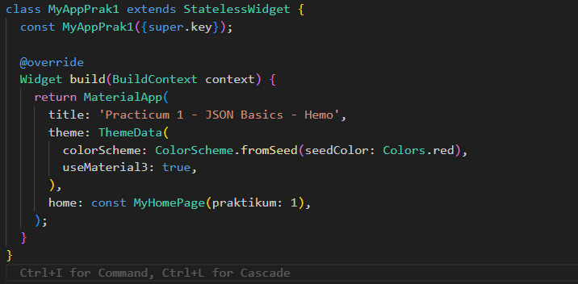
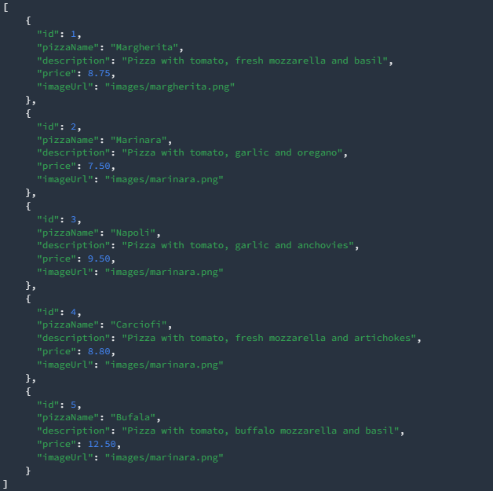
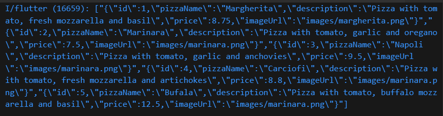
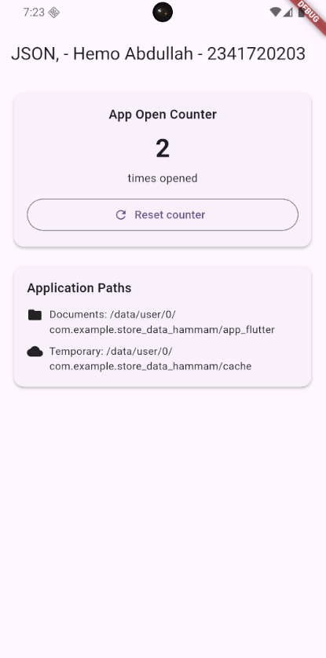
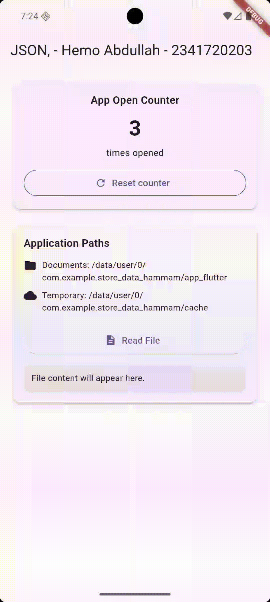
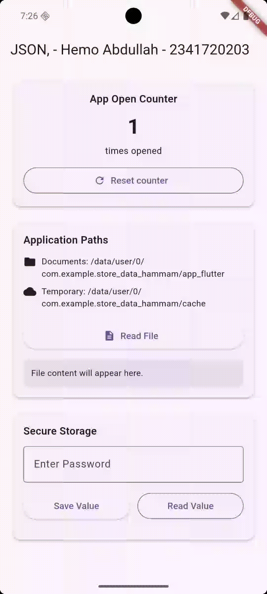

# 📘 Week 13 – Data Persistence in Flutter

- **Name:** Hammam Abdullah  
- **NIM:** 2341720203  
- **Course:** Mobile Programming – Data Persistence

This week I implemented all seven practicums from the official codelab about **JSON, SharedPreferences, filesystem, and secure storage**. Below is my report in my own words, following the same style as week 11 and week 12.

Each practicum section contains:
- **Title**  
- **Explanation (what I did and why)**  
- **Output (screenshot / GIF)**  
- **Key code I used**  
- **What I learned**  

---

## Practicum 1 – Loading JSON from Assets

### Explanation
In this first practicum I prepared the project to work with JSON data:
- Created the `assets` folder and the `pizzalist.json` file based on the codelab.  
- Registered the asset in `pubspec.yaml` so Flutter can bundle it.  
- Added a method `readJsonFile()` inside `_MyHomePageState` to load the JSON string from `assets/pizzalist.json` using `DefaultAssetBundle.of(context).loadString(...)`.  
- Parsed the JSON into a `List` using `jsonDecode` and later converted it into a `List<Pizza>`.  

This is the foundation for all the next practicums, because everything starts from reading that pizza JSON.

### Output

- Initial app with my customized title and theme:  
  

- JSON successfully loaded and displayed as part of the UI (before converting to model):  
  

- Full interaction demo as I scroll through the JSON-based content:  
  

### Key Code Used

```dart
Future<List<Pizza>> readJsonFile() async {
  String myString = await DefaultAssetBundle.of(
    context,
  ).loadString('assets/pizzalist.json');

  List pizzaMapList = jsonDecode(myString);

  List<Pizza> myPizzas = [];
  for (var pizza in pizzaMapList) {
    Pizza myPizza = Pizza.fromJson(pizza);
    myPizzas.add(myPizza);
  }

  String json = convertToJSON(myPizzas);
  debugPrint(json);

  return myPizzas;
}
```

### What I Learned
- How to declare and register **asset folders** in Flutter.  
- How to read a JSON file from assets using `DefaultAssetBundle`.  
- Basic usage of `jsonDecode` and how to turn a JSON string into a Dart `List`.  
- That separating the loading logic into its own method (`readJsonFile`) makes the code easier to extend.

---

## Practicum 2 – Converting JSON to Dart Model (Pizza)

### Explanation
After being able to read raw JSON, I refactored the code to use a **strongly typed model**:
- Created the file `lib/model/pizza.dart`.  
- Defined the `Pizza` class with fields `id`, `pizzaName`, `description`, `price`, and `imageUrl`.  
- Implemented a `fromJson` constructor and `toJson` method so I can easily convert between `Map` and `Pizza`.  
- Added constant keys (like `keyId`, `keyName`) to avoid hard-coded string literals everywhere.

This makes the rest of the app work with `Pizza` objects instead of dynamic `Map`, which is safer and easier to maintain.

### Output

- Demonstration of pizzas loaded as model objects and displayed cleanly in the UI:  
  

### Key Code Used

```dart
const keyId = 'id';
const keyName = 'pizzaName';
const keyDescription = 'description';
const keyPrice = 'price';
const keyImage = 'imageUrl';

class Pizza {
  final int id;
  final String pizzaName;
  final String description;
  final double price;
  final String imageUrl;

  Pizza.fromJson(Map<String, dynamic> json)
      : id = int.tryParse(json[keyId].toString()) ?? 0,
        pizzaName = json[keyName] != null ? json[keyName].toString() : 'No name',
        description = json[keyDescription] != null
            ? json[keyDescription].toString()
            : '',
        price = double.tryParse(json[keyPrice].toString()) ?? 0,
        imageUrl = json[keyImage] ?? '';

  Map<String, dynamic> toJson() {
    return {
      keyId: id,
      keyName: pizzaName,
      keyDescription: description,
      keyPrice: price,
      keyImage: imageUrl,
    };
  }
}
```

### What I Learned
- Why using a **model class** is better than working with raw `Map` everywhere.  
- How to build a constructor like `Pizza.fromJson` that converts a Map into a Dart object.  
- How to prepare data for serialization again using `toJson()`.  
- That clearly named constants for JSON keys reduce the chance of typos.

---

## Practicum 3 – Making JSON Parsing Safer

### Explanation
In this practicum I focused on **data safety and compatibility**:
- Followed the codelab instructions to intentionally break some fields (wrong types, null values) and observed the errors.  
- Updated the `Pizza.fromJson` constructor to use `int.tryParse`, `double.tryParse`, and null-coalescing operators so the app does not crash even if the JSON is not perfect.  
- Ensured that missing names become `'No name'` and invalid prices fall back to `0`.

### Output

- App still runs correctly even when the JSON data is not 100% clean:  
  

- Detailed screen showing data that has been parsed safely:  
  

### Key Code Used

```dart
Pizza.fromJson(Map<String, dynamic> json)
    : id = int.tryParse(json[keyId].toString()) ?? 0,
      pizzaName = json[keyName] != null ? json[keyName].toString() : 'No name',
      description = json[keyDescription] != null
          ? json[keyDescription].toString()
          : '',
      price = double.tryParse(json[keyPrice].toString()) ?? 0,
      imageUrl = json[keyImage] ?? '';
```

### What I Learned
- How to defend my app against **invalid or incomplete JSON**.  
- That `tryParse` and `??` are simple but powerful tools for safe parsing.  
- The importance of always returning a valid `Pizza` object even when data is messy.  
- How small validation changes in the model can make the whole UI more robust.

---

## Practicum 4 – App Counter with SharedPreferences

### Explanation
For this practicum I implemented a simple **persistent counter** using `SharedPreferences`:
- Added `shared_preferences` as a dependency and imported it in `main.dart`.  
- Declared `int appCounter = 0;` in `_MyHomePageState`.  
- Implemented `readAndWritePreference()` to read the counter from storage, increment it, save it back, and update the state.  
- Implemented `deletePreference()` to clear the stored value and reset the counter in the UI.  
- Displayed the counter inside a Material `Card` so it looks clean and modern.

### Output

- Counter automatically increasing every time I open the app, with a reset button:  
  

### Key Code Used

```dart
int appCounter = 0;

Future readAndWritePreference() async {
  SharedPreferences prefs = await SharedPreferences.getInstance();
  appCounter = prefs.getInt('appCounter') ?? 0;
  appCounter++;
  await prefs.setInt('appCounter', appCounter);
  setState(() {
    appCounter = appCounter;
  });
}

Future deletePreference() async {
  SharedPreferences prefs = await SharedPreferences.getInstance();
  await prefs.clear();
  setState(() {
    appCounter = 0;
  });
}
```

### What I Learned
- How to store **small key–value pairs** locally using `SharedPreferences`.  
- How to read, update, and clear values asynchronously.  
- That placing the call in `initState()` makes the counter update as soon as the widget is created.  
- A very common pattern for showing simple persistent settings or statistics in an app.

---

## Practicum 5 – Discovering App Paths with path_provider

### Explanation
Here I integrated the `path_provider` package to access the **documents** and **temporary** directories of the app:
- Added `path_provider` to `pubspec.yaml` and imported it.  
- Declared two state variables: `documentsPath` and `tempPath`.  
- Implemented `getPaths()` to call `getApplicationDocumentsDirectory()` and `getTemporaryDirectory()`, then stored the paths in state.  
- Called `getPaths()` inside `initState()` so the values are ready when the UI appears.  
- Displayed both paths in the **Application Paths** card with icons so I know exactly where my app stores files.

### Output

- Paths for documents and cache displayed on screen:  
  

### Key Code Used

```dart
String documentsPath = '';
String tempPath = '';

Future<void> getPaths() async {
  final docDir = await getApplicationDocumentsDirectory();
  final tempDir = await getTemporaryDirectory();
  setState(() {
    documentsPath = docDir.path;
    tempPath = tempDir.path;
  });
}
```

### What I Learned
- How to use `path_provider` to obtain platform‑specific paths.  
- The difference between **documents directory** and **temporary cache directory**.  
- Why we should not hard-code paths but always ask the OS through this package.  
- How these paths are useful for later file read/write operations.

---

## Practicum 6 – Read & Write Text File

### Explanation
In this practicum I combined the previous knowledge to actually **write and read a file**:
- Imported `dart:io` and declared `late File myFile;` plus a `fileText` string.  
- After `getPaths()` completes in `initState()`, I created `myFile = File('$documentsPath/pizzas.txt');` and called `writeFile()`.  
- Inside `writeFile()` I stored my **full name and NIM** into the file using `writeAsString`.  
- Implemented `readFile()` which reads the same file with `readAsString()` and updates `fileText` so it appears in the UI when I press **Read File**.

### Output

- GIF showing the Read File button and the text loaded from the stored file:  
  

### Key Code Used

```dart
late File myFile;
String fileText = '';

Future<bool> writeFile() async {
  try {
    await myFile.writeAsString('Hamam Abdulllah, 2341720203');
    return true;
  } catch (e) {
    return false;
  }
}

Future<bool> readFile() async {
  try {
    String fileContent = await myFile.readAsString();
    setState(() {
      fileText = fileContent;
    });
    return true;
  } catch (e) {
    return false;
  }
}
```

### What I Learned
- How to work with the `File` class in Flutter/Dart.  
- The pattern `writeFile()` + `readFile()` with try–catch for error handling.  
- How asynchronous file operations integrate with `setState()` to refresh the UI.  
- A realistic use case for saving small text data to local storage.

---

## Practicum 7 – Secure Storage for Sensitive Data

### Explanation
The last practicum focuses on **secure data storage** using `flutter_secure_storage`:
- Added the dependency and imported `FlutterSecureStorage`.  
- Declared `pwdController` to capture the password and `myPass` to show the decrypted value.  
- Created a `FlutterSecureStorage` instance and a key `myKey = 'myPass'`.  
- Implemented `writeToSecureStorage()` to save the value from the text field into secure storage.  
- Implemented `readFromSecureStorage()` to read it back, and updated `myPass` using `setState()` when the user taps **Read Value**.  
- Wrapped everything in a nice card with `TextField`, buttons, and a container that shows the stored password.

### Output

- GIF showing saving and reading the secret value securely:  
  

### Key Code Used

```dart
final pwdController = TextEditingController();
String myPass = '';
final storage = const FlutterSecureStorage();
final myKey = 'myPass';

Future<void> writeToSecureStorage() async {
  await storage.write(key: myKey, value: pwdController.text);
}

Future<String> readFromSecureStorage() async {
  String secret = await storage.read(key: myKey) ?? '';
  return secret;
}
```

### What I Learned
- The difference between simple preferences and **encrypted secure storage**.  
- How to design a small UI flow for entering, saving, and reading sensitive data.  
- Why we should not store passwords or secrets in plain text or simple SharedPreferences.  
- How these concepts map to real-world features like login tokens or user secrets.

---

## Overall Reflection

By completing all seven practicums, I learned how to:
- Load and parse JSON from assets into strong Dart models.  
- Handle invalid data safely and keep the app stable.  
- Persist small values with `SharedPreferences`.  
- Work with the filesystem using `path_provider` and `dart:io`.  
- Store sensitive data securely with `flutter_secure_storage`.  

These techniques are essential for any real Flutter app that needs to remember user data or work offline.

