## Week 14 – RESTful API in Flutter

- **Name:** Hammam Abdullah  
- **NIM:** 2341720203  
- **Course:** Mobile Programming – Data Persistence

This week implements the codelab **#14 RESTful API** using a pizza list
application connected to a mock backend (Wiremock).

Base mock API used in this project:

- **Wiremock base URL:** `https://31k7g.wiremockapi.cloud`
- **GET pizzas:** `GET /json/1`
- **POST / PUT / DELETE:** `POST /json`, `PUT /json`, `DELETE /json`

The Flutter project is in the `week14` folder and uses multiple entrypoints
(`main1.dart`–`main4.dart`) so each Praktikum can be run separately.

--
## Table of Contents

1. [Praktikum 1 – GET + Singleton](#praktikum-1--get-pizza-list--singleton)
2. [Praktikum 2 – POST (Create Pizza)](#praktikum-2--post-create-pizza)
3. [Praktikum 3 – PUT (Update Pizza)](#praktikum-3--put-update-pizza)
4. [Praktikum 4 – DELETE (Dismissible)](#praktikum-4--delete-dismissible)
5. [Core Classes](#core-classes)
6. [Wiremock Configuration Summary](#wiremock-configuration-summary)

---

## Praktikum 1 – GET Pizza List + Singleton

- **File:** `lib/main1.dart`

### Explanation

In this first practicum I prepared the basic connection to the RESTful service:

- Implemented the `HttpHelper` class as a **Singleton**, so the same instance is
  reused everywhere in the app.
- Connected the app to Wiremock using the `GET /json/1` endpoint to load the
  initial list of pizzas.
- Displayed the pizzas with a custom teal theme and card-based list in
  `main1.dart`, as required in Soal 1 (custom app title and color).

### Key Code Used

**Singleton `HttpHelper` + GET /json/1**

```dart
class HttpHelper {
  final String authority = '31k7g.wiremockapi.cloud';
  // GET stub in Wiremock: GET /json/1
  final String path = 'json/1';

  // Implementasi Singleton
  static final HttpHelper _httpHelper = HttpHelper._internal();
  factory HttpHelper() => _httpHelper;
  HttpHelper._internal();

  Future<List<Pizza>> getPizzaList() async {
    final Uri url = Uri.https(authority, path);
    final http.Response result = await http.get(url);

    if (result.statusCode == HttpStatus.ok) {
      final jsonResponse = json.decode(result.body);
      return jsonResponse
          .map<Pizza>((i) => Pizza.fromJson(i))
          .toList();
    } else {
      return [];
    }
  }
}
```

**Menampilkan List di `main1.dart`**

```dart
class _MyHomePageStatePraktikum1 extends State<MyHomePagePraktikum1> {
  final HttpHelper helper = HttpHelper();
  late Future<List<Pizza>> _pizzasFuture;

  @override
  void initState() {
    super.initState();
    _pizzasFuture = helper.getPizzaList();
  }

  @override
  Widget build(BuildContext context) {
    return Scaffold(
      appBar: AppBar(
        title: const Text('JSON by Hammam – Praktikum 1'),
        backgroundColor: Colors.teal.shade700,
      ),
      body: FutureBuilder<List<Pizza>>(
        future: _pizzasFuture,
        builder: (context, snapshot) {
          if (snapshot.connectionState == ConnectionState.waiting) {
            return const Center(child: CircularProgressIndicator());
          }
          if (snapshot.hasError) {
            return const Center(child: Text('Something went wrong'));
          }
          if (!snapshot.hasData || snapshot.data!.isEmpty) {
            return const Center(child: Text('No pizzas found.'));
          }

          final pizzas = snapshot.data!;
          return ListView.builder(
            padding: const EdgeInsets.all(12),
            itemCount: pizzas.length,
            itemBuilder: (context, position) {
              final pizza = pizzas[position];
              return Card(
                margin: const EdgeInsets.symmetric(vertical: 6),
                elevation: 2,
                child: ListTile(
                  leading: CircleAvatar(
                    backgroundColor: Colors.teal.shade100,
                    child: Text(
                      pizza.pizzaName.isNotEmpty
                          ? pizza.pizzaName[0].toUpperCase()
                          : '?',
                    ),
                  ),
                  title: Text(pizza.pizzaName),
                  subtitle: Text(
                    '${pizza.description} - € ${pizza.price?.toStringAsFixed(2) ?? 'N/A'}',
                  ),
                ),
              );
            },
          );
        },
      ),
    );
  }
}
```

### Output

- 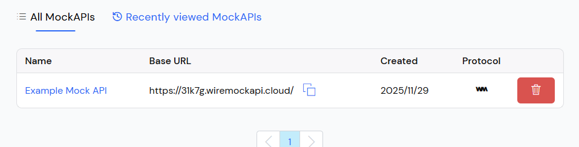 – First run of Practicum 1
  with my custom app title **"JSON by Hammam – Praktikum 1"** and teal theme,
  matching the jobsheet requirement to personalize the UI.
- 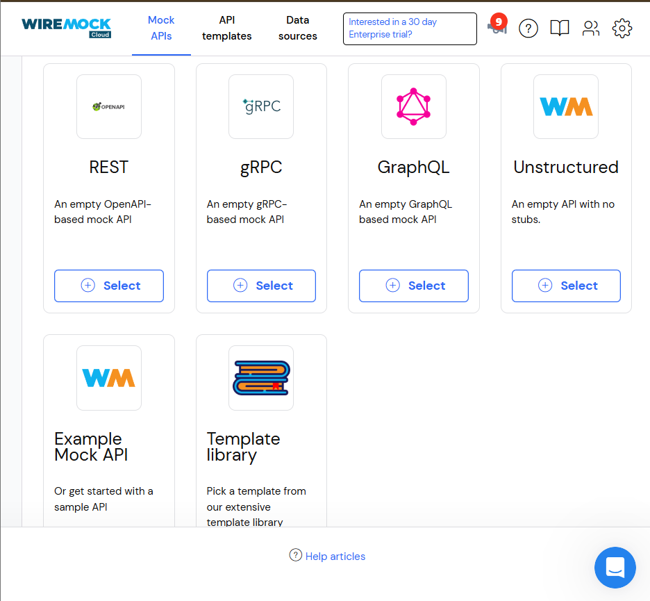 – Pizza list successfully
  loaded from **GET /json/1** and rendered as a vertical card list.
- 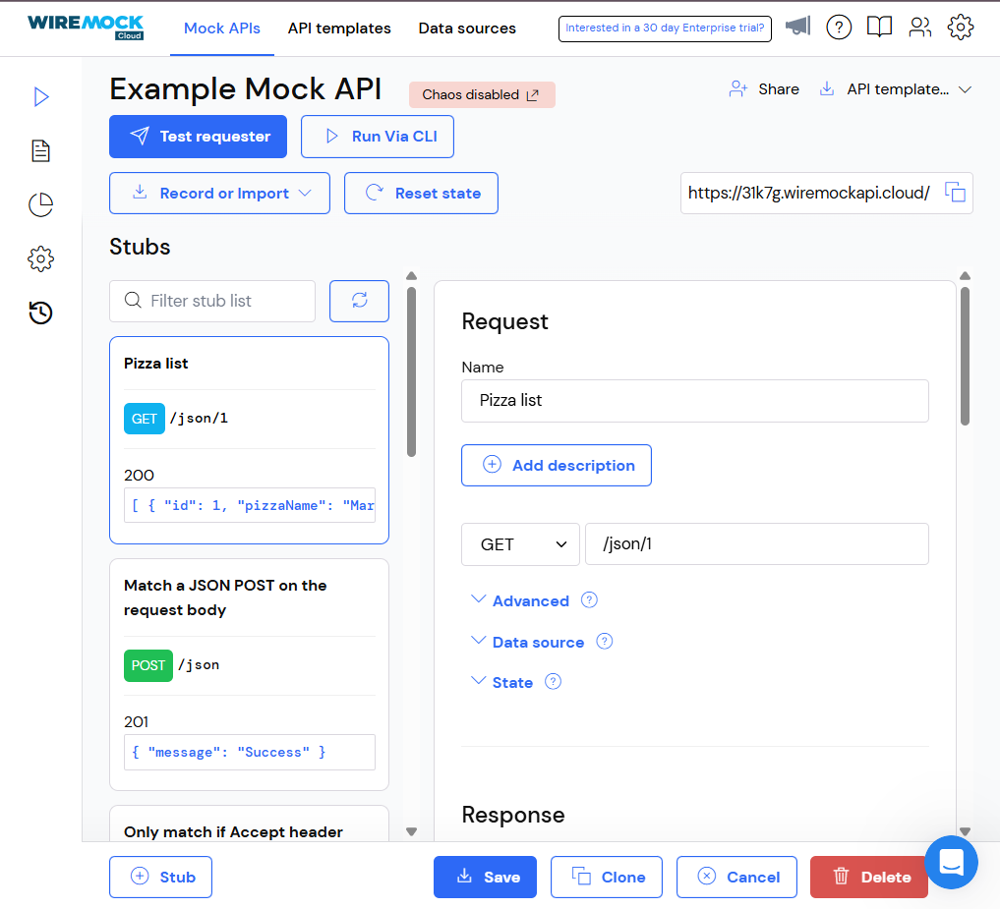 – Scrolling through the
  list, showing that all pizzas from the JSON array are displayed consistently.
- 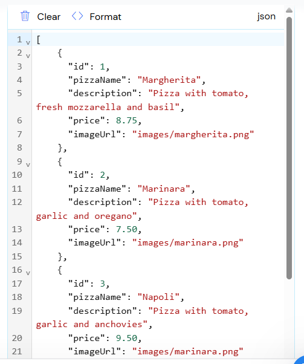 – Example of the state when
  there are no pizzas (the app shows the "No pizzas found." fallback instead of
  crashing).
- 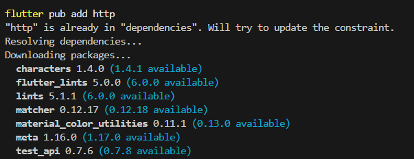 – Close-up of one pizza
  card (name, description, price) proving that the JSON fields are mapped
  correctly into the UI.
- 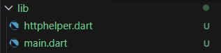 – Focus on the AppBar area
  only, emphasizing the custom title and theme color.
- 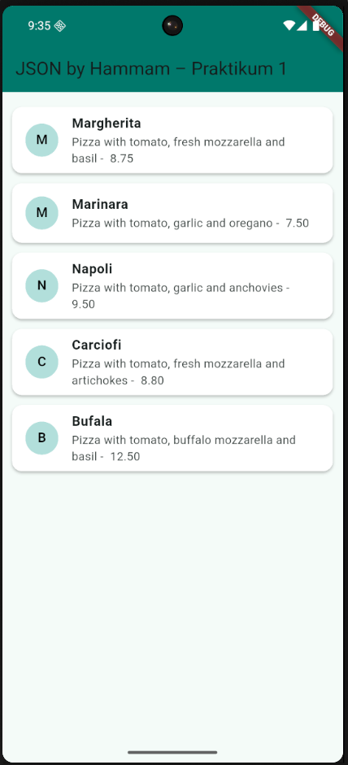 – Overall view of Practicum 1
  running on the emulator, used as the main output screenshot in the report.

### What I Learned

- How to build an HTTP service as a **Singleton** in Flutter.
- How to use `FutureBuilder` to wait for asynchronous network responses.
- How to render JSON data as a clean card list using `Card` + `ListTile`.
- How to connect a Flutter app to a mock REST API (Wiremock).

**How to run (emulator/simulator):**

```bash
flutter run -t lib/main1.dart
```

---

## Praktikum 2 – POST (Create Pizza)

- **File:** `lib/main2.dart`

### Explanation

In Practicum 2 I implemented the **POST** verb to insert a new pizza into the
mock service:

- Created a POST stub `/json` in Wiremock that responds with
  `{ "message": "The pizza was posted" }` as described in the jobsheet.
- Added the `postPizza()` method to `HttpHelper` to send a JSON body to that
  endpoint.
- Built the `PizzaDetailScreen` form with `TextField`s for ID, name,
  description, price, and image URL, plus a vegetarian switch.
- Added a `FloatingActionButton` in `main2.dart` that opens the detail screen
  in **New Pizza** mode (`isNew = true`).

### Key Code Used

**Metode POST di `HttpHelper`**

```dart
Future<String> postPizza(Pizza pizza) async {
  const postPath = '/json'; // Stub: POST /json
  String post = json.encode(pizza.toJson());
  Uri url = Uri.https(authority, postPath);

  http.Response r = await http.post(
    url,
    headers: <String, String>{
      'Content-Type': 'application/json; charset=UTF-8',
    },
    body: post,
  );
  return r.body;
}
```

**Navigasi ke `PizzaDetailScreen` (mode POST)**

```dart
floatingActionButton: FloatingActionButton(
  child: const Icon(Icons.add),
  onPressed: () {
    Navigator.push(
      context,
      MaterialPageRoute(
        builder: (context) => PizzaDetailScreen(
          pizza: Pizza(pizzaName: '', description: ''),
          isNew: true,
        ),
      ),
    ).then((_) => _refreshList());
  },
),
```

**Form di `PizzaDetailScreen` (ringkasan)**

```dart
class _PizzaDetailScreenState extends State<PizzaDetailScreen> {
  final TextEditingController txtId = TextEditingController();
  final TextEditingController txtName = TextEditingController();
  final TextEditingController txtDescription = TextEditingController();
  final TextEditingController txtPrice = TextEditingController();
  final TextEditingController txtImageUrl = TextEditingController();
  bool isVegetarian = false;
  String operationResult = '';

  Future savePizza() async {
    HttpHelper helper = HttpHelper();
    Pizza pizza = Pizza(
      id: int.tryParse(txtId.text),
      pizzaName: txtName.text,
      description: txtDescription.text,
      price: double.tryParse(txtPrice.text),
      imageUrl: txtImageUrl.text,
      isVegetarian: isVegetarian,
    );

    final result = await (widget.isNew
        ? helper.postPizza(pizza)
        : helper.putPizza(pizza));

    setState(() {
      final jsonResult = json.decode(result);
      operationResult = jsonResult['message'] ?? result;
    });
  }
}
```

### Output

- 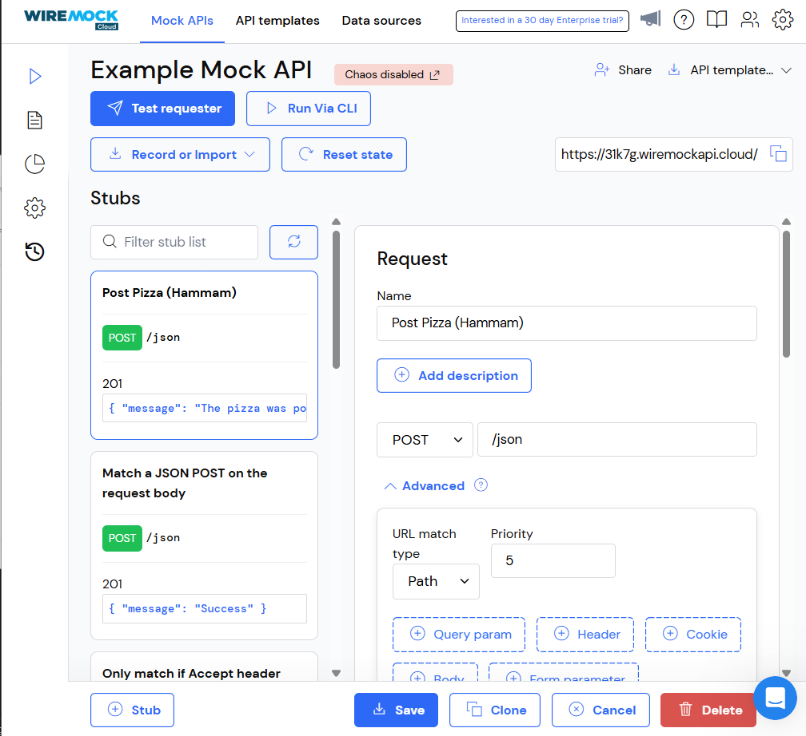 – New Pizza screen with
  all text fields and the **Send Post** button, showing the UI after following
  the form-building steps in the jobsheet.
- 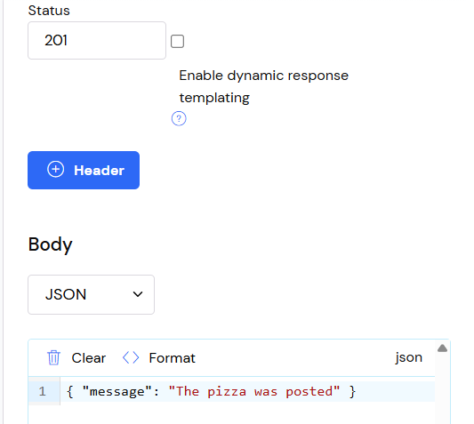 – Form filled with sample
  pizza data (ID, name, description, price, image URL) right before sending the
  POST request.
- 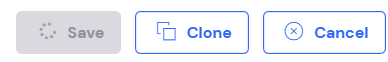 – The result label at the top
  of the screen displaying the message from Wiremock (for example
  "The pizza was posted").
- 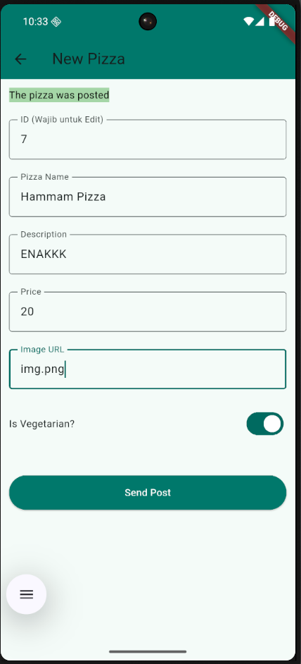 – The Wiremock UI
  showing the configured **POST /json** stub (name, verb, path, status 201, and
  JSON body), which is exactly what the jobsheet asks for in the POST section.

### What I Learned

- How to send a **JSON body** with `http.post` to a REST API.
- How to use `TextEditingController` and clean them up in `dispose()`.
- How to display the server response message in the UI after a POST request.
- A typical pattern for forms: fill data → send POST → show the result.

**How to run (emulator/simulator):**

```bash
flutter run -t lib/main2.dart
```

---

## Praktikum 3 – PUT (Update Pizza)

- **File:** `lib/main3.dart`

### Explanation

Practicum 3 focuses on **updating existing data** using the PUT verb:

- Created a PUT stub `/json` in Wiremock that returns
  `{ "message": "Pizza was updated" }`.
- Implemented the `putPizza()` method in `HttpHelper`.
- Extended `PizzaDetailScreen` to accept a `pizza` object and an `isNew` flag,
  so the same screen can be used for both POST and PUT.
- When the user taps a pizza in the list, the app opens the form in
  **Edit Pizza** mode (`isNew = false`) with all fields pre-filled from that
  pizza.

### Key Code Used

**Metode PUT di `HttpHelper`**

```dart
Future<String> putPizza(Pizza pizza) async {
  const putPath = '/json'; // Stub: PUT /json
  String put = json.encode(pizza.toJson());
  Uri url = Uri.https(authority, putPath);

  http.Response r = await http.put(
    url,
    headers: <String, String>{
      'Content-Type': 'application/json; charset=UTF-8',
    },
    body: put,
  );
  return r.body;
}
```

**Membuka detail dalam mode edit**

```dart
onTap: () {
  Navigator.push(
    context,
    MaterialPageRoute(
      builder: (context) => PizzaDetailScreen(
        pizza: currentPizza,
        isNew: false,
      ),
    ),
  ).then((_) => _refreshList());
},
```

**Inisialisasi form ketika edit**

```dart
@override
void initState() {
  if (!widget.isNew) {
    txtId.text = widget.pizza.id?.toString() ?? '';
    txtName.text = widget.pizza.pizzaName;
    txtDescription.text = widget.pizza.description;
    txtPrice.text = widget.pizza.price?.toString() ?? '';
    txtImageUrl.text = widget.pizza.imageUrl ?? '';
    isVegetarian = widget.pizza.isVegetarian;
  } else {
    txtId.text = '';
    isVegetarian = false;
  }
  super.initState();
}
```

### Output (Soal 3)

- 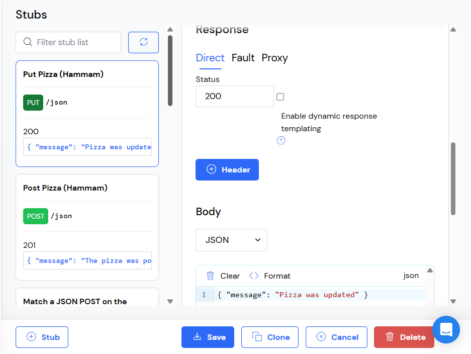 – Practicum 3 list screen with
  pizzas loaded from **GET /json/1**. Tapping any item will start the update
  flow described in the jobsheet.
- 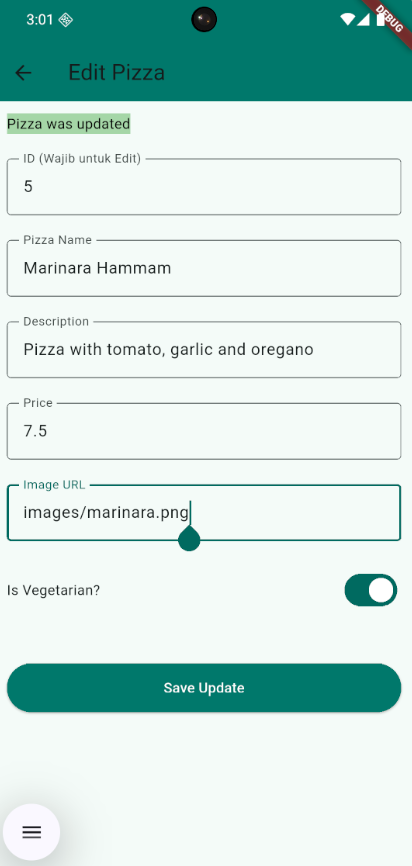 – **Edit Pizza** screen opened
  from the list; all fields are pre-filled from the selected pizza. Here I
  updated the text to include my name and NIM (Hammam Abdullah / 2341720203) as
  requested by the task.
- 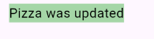 – The result label at the top
  shows the success message from the PUT stub (for example "Pizza was
  updated").

#### GIF

- 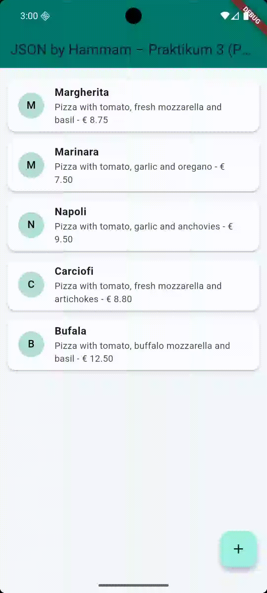 – End-to-end demonstration:
  starting from the list, tapping a pizza, editing the fields to include my
  identity, pressing **Save Update**, and finally seeing the PUT response and
  updated data.

### What I Learned

- How to **reuse** the same detail screen for both create (POST) and update
  (PUT) using an `isNew` flag.
- How to pre-fill form fields from a model object inside `initState()`.
- How to show server feedback (“Pizza was updated”) directly in the UI.
- The typical workflow for updating data: choose item → edit → send PUT →
  refresh list.

**How to run (emulator/simulator):**

```bash
flutter run -t lib/main3.dart
```

---

## Praktikum 4 – DELETE (Dismissible)

- **File:** `lib/main4.dart`

### Explanation

In the last practicum I implemented **DELETE** using a swipe gesture with the
`Dismissible` widget:

- Created a DELETE stub `/json` in Wiremock that returns
  `{ "message": "Pizza was deleted" }`.
- Added the `deletePizza()` method to `HttpHelper`.
- Wrapped each list item in `Dismissible` so when the user swipes a card to the
  right, the app calls the DELETE endpoint and removes that pizza from the
  visible list.

### Key Code Used

**Metode DELETE di `HttpHelper`**

```dart
Future<String> deletePizza(int id) async {
  const deletePath = '/json'; // Stub: DELETE /json
  Uri url = Uri.https(authority, deletePath);

  http.Response r = await http.delete(url);
  return r.body;
}
```

**List dengan `Dismissible`**

```dart
return ListView.builder(
  padding: const EdgeInsets.all(12),
  itemCount: pizzas.length,
  itemBuilder: (context, position) {
    final pizza = pizzas[position];

    return Dismissible(
      key: Key(pizza.id?.toString() ?? pizza.pizzaName),
      direction: DismissDirection.startToEnd,
      background: Container(
        color: Colors.red,
        alignment: Alignment.centerLeft,
        padding: const EdgeInsets.only(left: 20),
        child: const Icon(Icons.delete, color: Colors.white),
      ),
      onDismissed: (direction) async {
        if (pizza.id != null) {
          await helper.deletePizza(pizza.id!);
        }
        ScaffoldMessenger.of(context).showSnackBar(
          SnackBar(
            content: Text('${pizza.pizzaName} dismissed (API DELETE called)'),
          ),
        );
        _refreshList();
      },
      child: Card(
        margin: const EdgeInsets.symmetric(vertical: 6),
        elevation: 2,
        child: ListTile(
          leading: CircleAvatar(
            backgroundColor: Colors.teal.shade100,
            child: Text(
              pizza.pizzaName.isNotEmpty
                  ? pizza.pizzaName[0].toUpperCase()
                  : '?',
            ),
          ),
          title: Text(pizza.pizzaName),
          subtitle: Text(
            '${pizza.description} - € ${pizza.price?.toStringAsFixed(2) ?? 'N/A'}',
          ),
        ),
      ),
    );
  },
);
```

### Output (Soal 4)

- 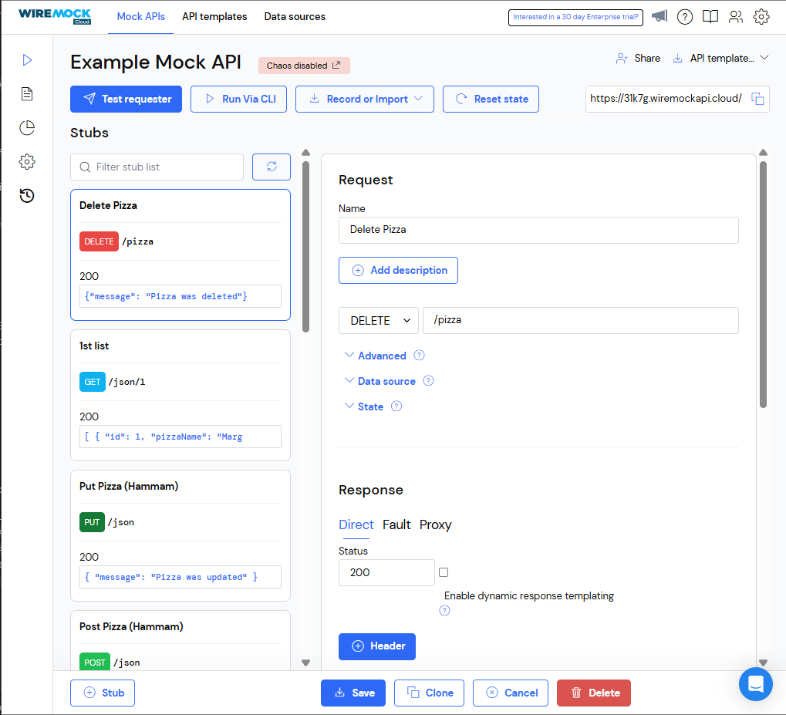 – Practicum 4 main
  screen, showing the list of pizzas wrapped in `Dismissible`. This is the
  starting point for the swipe-to-delete behaviour.
- 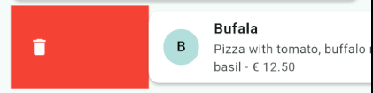 – A pizza card in the
  middle of being swiped to the right; the red background and trash icon
  appear, exactly like the jobsheet example for Dismissible.

#### GIF

- 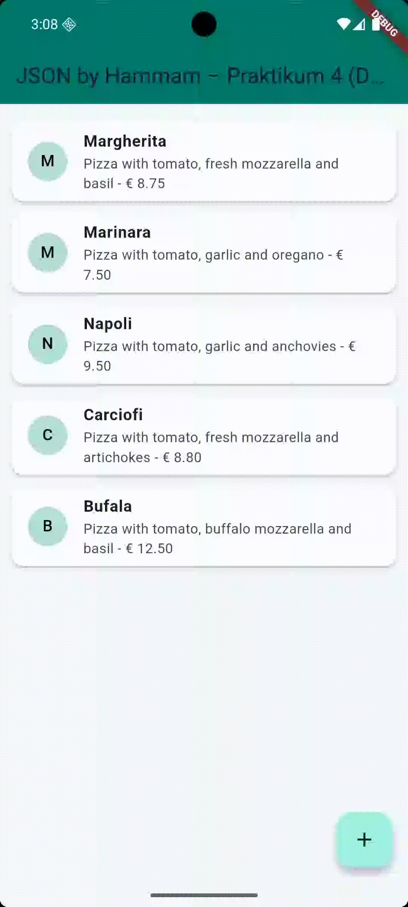 – Full animation of the
  delete flow: the user swipes a pizza card, the item disappears, a
  `SnackBar` confirms the delete, and Wiremock records a `DELETE /json`
  request.

### What I Learned

- How to use `Dismissible` to create more interactive list UIs.
- How to connect a UI gesture (swipe) to a REST **DELETE** operation.
- Why the list must be refreshed after a delete so the UI stays in sync with
  the backend.
- How DELETE completes the REST cycle together with GET, POST, and PUT.

**How to run (emulator/simulator):**

```bash
flutter run -t lib/main4.dart
```

---

## Core Classes

**Model `Pizza` (ringkasan)** – file `lib/pizza.dart`:

```dart
class Pizza {
  int? id;
  String pizzaName;
  String description;
  double? price;
  String? imageUrl;
  bool isVegetarian;

  Pizza({
    this.id,
    required this.pizzaName,
    required this.description,
    this.price,
    this.imageUrl,
    this.isVegetarian = false,
  });

  factory Pizza.fromJson(Map<String, dynamic> json) => Pizza(
        id: json['id'],
        pizzaName: json['pizzaName'],
        description: json['description'],
        price: (json['price'] as num?)?.toDouble(),
        imageUrl: json['imageUrl'],
        isVegetarian: json['isVegetarian'] ?? false,
      );

  Map<String, dynamic> toJson() => {
        'id': id,
        'pizzaName': pizzaName,
        'description': description,
        'price': price,
        'imageUrl': imageUrl,
        'isVegetarian': isVegetarian,
      };
}
```

---

## Wiremock Configuration Summary

| Purpose              | Method | Path    | Example Response                                    |
|----------------------|--------|---------|-----------------------------------------------------|
| List pizzas          | GET    | `/json/1` | `[{ "id": 1, "pizzaName": "Margherita", ... }]` |
| Create pizza (POST)  | POST   | `/json` | `{ "message": "The pizza was posted" }`          |
| Update pizza (PUT)   | PUT    | `/json` | `{ "message": "Pizza was updated" }`             |
| Delete pizza (DEL)   | DELETE | `/json` | `{ "message": "Pizza was deleted" }`            |

Semua app bar dan identitas menggunakan **Hammam Abdullah / 2341720203**
sesuai ketentuan mata kuliah.

