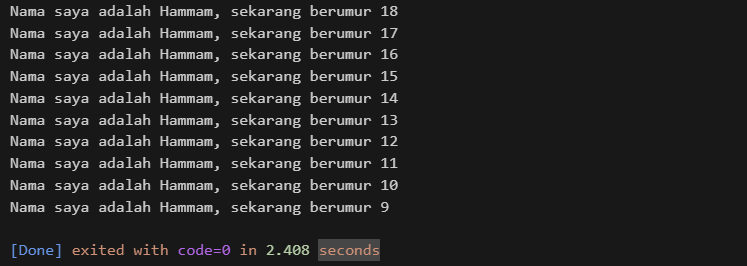
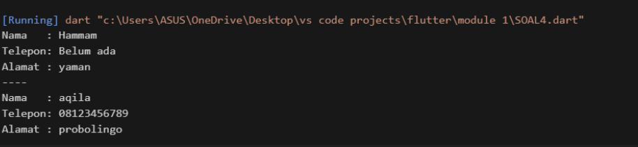

# Soal 1 : 
output :

``` dart
void main() {
  for (int i = 0; i < 10; i++) {
    print('Nama saya adalah Hammam, sekarang berumur ${18 - i}');
  }
}
```



# SOAL 2 : 
Why is it important to understand Dart before Flutter?

Because Flutter is built using the Dart language. If we don't master the basics of Dart (such as variables, data types, functions, loops, classes, OOP, and null safety), it will be difficult to understand how Flutter widgets work. By mastering Dart first, the process of creating mobile apps with Flutter becomes easier, more efficient, and less error-prone.

# SOAL 3 : 
Summary of key points from the Flutter codelab:

- Flutter uses the Dart programming language.
- All views in Flutter consist of Widgets (both stateless and stateful).
- Hot reloading helps speed up development by immediately seeing the results of code changes.
- The basic structure of a Flutter app starts with runApp() and the main widget.
- MaterialApp and Scaffold make it easy to create layouts that comply with Android standards.
- Understanding the concept of state management is crucial for consistent app data.

# SOAL 4:
``` dart 
class Mahasiswa {
  String nama;
  String? noTelepon;
  late String alamat;

  Mahasiswa(this.nama, this.noTelepon);

  void setAlamat(String alamatBaru) {
    alamat = alamatBaru;
  }

  void showData() {
    print("Nama   : $nama");
    print("Telepon: ${noTelepon ?? 'Belum ada'}");
    print("Alamat : $alamat");
  }
}

void main() {
  var mhs1 = Mahasiswa("Hammam", null);
  mhs1.setAlamat("yaman");
  mhs1.showData();

  print("----");

  var mhs2 = Mahasiswa("aqila", "08123456789");
  mhs2.setAlamat("probolingo");
  mhs2.showData();
}
```

- Null Safety (String? noTelepon) :
it shows optional data (sometimes filled, sometimes not).

- Late Variable (late String alamat) 
it shows data that must be set later (simulating something like a database fetch).