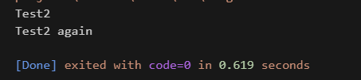
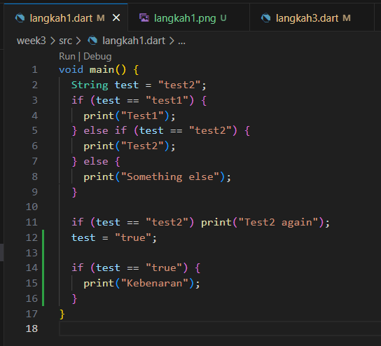
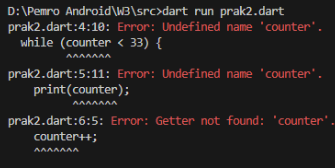
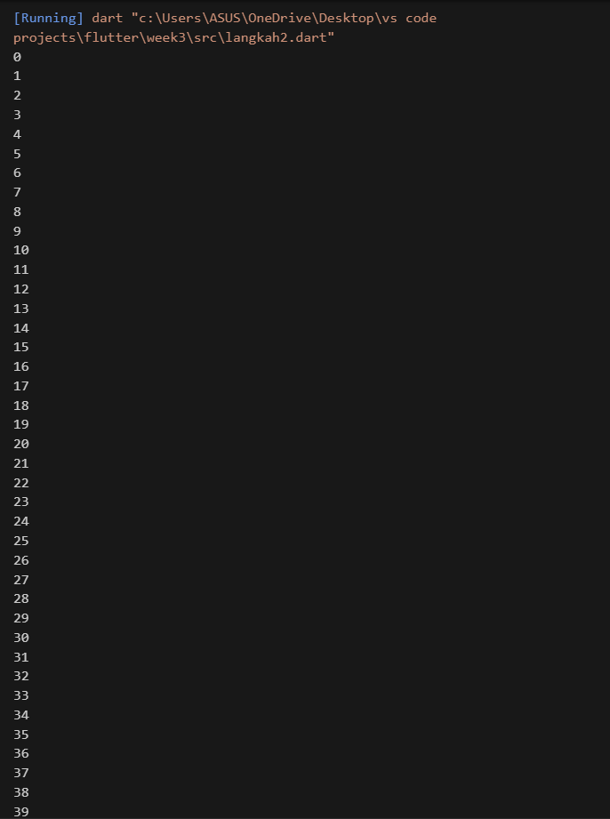
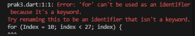
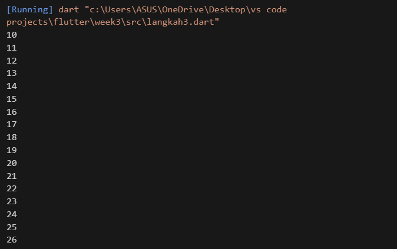
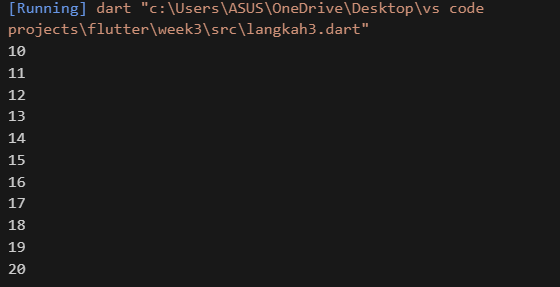
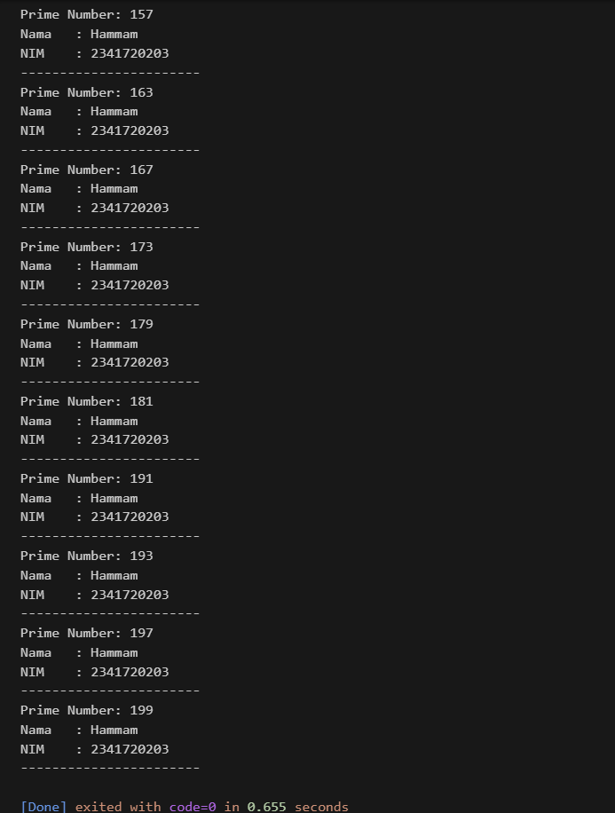

# Codelab 03: Conditional and Loop

## Practicum 1: Applying Control Flows ("if/else")

### Step 1
Code:
```dart
void main() {
  String test = "test2";
  if (test == "test1") {
    print("Test1");
  } else if (test == "test2") {
    print("Test2");
  } else {
    print("Something else");
  }

  if (test == "test2") print("Test2 again");
  test = "true";

  if (test == "true") {
    print("Kebenaran");
  }
}
````



### Step 2

**Explanation:**

* The variable `test` is initialized with `"test2"`.
* The first `if` (`test == "test1"`) is false.
* The second condition (`test == "test2"`) is true, so `"Test2"` is printed.
* Then the separate `if (test == "test2")` also runs and prints `"Test2 again"`.
* After that, `test` is set to `"true"`. The condition `if (test == "true")` is true, so it prints `"Kebenaran"`.

**Output:**

```
Test2
Test2 again


### Step 3




**Explanation:**  
```
The program starts with a variable test set to "test2".
The first if checks if test is "test1", but it is not, so nothing prints.
The else if checks if test is "test2". This is true, so it prints Test2.
The else part is skipped because one condition was already true.
After that, there is another if (test == "test2"). Since test is still "test2", it prints Test2 again.
Then the program changes test to "true".
The last if (test == "true") is now true, so it prints Kebenaran.
```
---

```
**Output:**
Test2
Test2 again
kebenaran
```

## Practicum 2: Applying Loops ("while" and "do-while")

### Step 1

Code:

```dart
void main() {

  while (counter < 33) {
    print(counter);
    counter++;
  } }
```

### Step 2



**Explanation:**

we will get an Error because the counter has not been initialized so the counter variable has never been declared.
to fix the code : 

```dart
void main() {
  int counter = 0;

  while (counter < 33) {
    print(counter);
    counter++;
  }
  do {
    print(counter);
    counter++;
  } while (counter < 77);
}
```

**Output:**



---
### Step 3

**Explanation:**  
```
After the while loop ends, the variable counter has the value 33.
Then the program moves to the do..while loop. In this kind of loop, the code inside do { ... } always runs at least once before checking the condition.

Since counter starts at 33, and the condition is counter < 77, the loop keeps running until counter reaches 77. That means the program prints the numbers from 33 up to 76.
```

## Practicum 3: Applying "for" Loop and "break-continue"

### Step 1

Code:

```dart
void main() {
  for (int index = 10; index < 27; index++) {
    print(index);
  }
}
```

**Output:**




### Step 2

**Explanation:**

A problem happened when running the program because the variable name was written with different cases (Index and index). Dart is case-sensitive, so Index and index are not the same.
Also, in the loop, the increment part was written incorrectly as just index. It should be index++ to increase the value properly.

the program After fixing these two issues:



```
so it prints the current value of index to the console.
 As a result, the output shows the numbers from 10 up to 26. The number 27 is not included, because when index reaches 27, the loop condition index < 27 becomes false, and the loop stops
 ```

---

### Step 3
code:
```dart
void main() {
  for (int index = 10; index < 27; index++) {
    if (index == 21) break;                  
    else if (index > 1 && index < 7) continue; 
    print(index);
  }
}
```
**Output:**



**explanation**
```
- The program runs a for loop starting at index = 10 and continues as long as index < 27.
- When index reaches 21, the break statement stops the loop, so the loop ends there.
- The continue condition (index > 1 && index < 7) never happens because the loop starts at 10, not below 7.
- That means the program prints the numbers 10 to 20 only.
```

## Practicum Assignment
--- 
1. Complete Practicums 1 to 3, with explanations and screenshots.
--- 
Done!

---
2. Write a program that prints all prime numbers from 0 to 201 using Dart.
   * For each prime number, also print your name and student ID (NIM).

### Code

```dart
void main() {
  String nama = "Hammam";
  String nim = "2341720203";

  for (int i = 0; i <= 201; i++) {
    if (isPrima(i)) {
      print("Prime Number: $i");
      print("Nama   : $nama");
      print("NIM    : $nim");
      print("-----------------------");
    }
  }
}

//checking
bool isPrima(int angka) {
  if (angka < 2) return false;
  for (int i = 2; i <= angka ~/ 2; i++) {
    if (angka % i == 0) {
      return false;
    }
  }
  return true;
}

```
**Output:**



### Explanation

* The loop checks every number from 0 to 201.
* The `isPrime` function tests if the number has divisors other than 1 and itself.
* If the number is prime, it prints the number along with your name and NIM.

