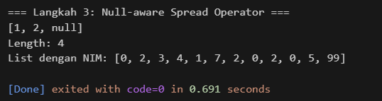

# Hammam-Abdullah_Lab04

## Praktikum 1: Eksperimen Tipe Data List

### Langkah 1:
Ketik atau salin kode program berikut ke dalam void main().

```dart
var list = [1, 2, 3];
assert(list.length == 3);
assert(list[1] == 2);
print(list.length);
print(list[1]);

list[1] = 1;
assert(list[1] == 1);
print(list[1]);
```
### Langkah 2:
Silakan coba eksekusi (Run) kode pada langkah 1 tersebut. Apa yang terjadi? Jelaskan!

#### Answer


Penjelasan:

1. print(list.length); → mencetak 3 (panjang list [1, 2, 3])
2. print(list[1]); → mencetak 2 (elemen pada index 1)
3. list[1] = 1; → mengubah elemen index 1 dari 2 menjadi 1
4. print(list[1]); → mencetak 1 (elemen index 1 setelah diubah)
Semua assert statements berjalan tanpa error karena kondisinya benar.


### Langkah 3:
Ubah kode pada langkah 1 menjadi variabel final yang mempunyai index = 5 dengan default value = null. Isilah nama dan NIM Anda pada elemen index ke-1 dan ke-2. Lalu print dan capture hasilnya.

Apa yang terjadi ? Jika terjadi error, silakan perbaiki.

#### Answer


Penjelasan:

1. final variable: finalList dideklarasikan sebagai final (tidak bisa diubah referensinya)
2. index = 5: List memiliki 5 elemen (index 0-4)
3. default value = null: Semua elemen diinisialisasi dengan null
4. Nama di index 1: "Charellino Kalingga Sadewo"
5. NIM di index 2: "2341720205"
6. String?: Tipe data nullable string untuk mengakomodasi null values

## Praktikum 2: Eksperimen Tipe Data Set
Selesaikan langkah-langkah praktikum berikut ini menggunakan VS Code atau Code Editor favorit Anda.

### Langkah 1:
Ketik atau salin kode program berikut ke dalam fungsi main().

```dart
var halogens = {'fluorine', 'chlorine', 'bromine', 'iodine', 'astatine'};
print(halogens);
```

### Langkah 2:
Silakan coba eksekusi (Run) kode pada langkah 1 tersebut. Apa yang terjadi? Jelaskan! Lalu perbaiki jika terjadi error.

### Answer 


Deklarasi menggunakan {} dengan elemen langsung akan membuat sebuah Set di Dart.

### Langkah 3:
Tambahkan kode program berikut, lalu coba eksekusi (Run) kode Anda.

```dart
var names1 = <String>{};
Set<String> names2 = {}; // This works, too.
var names3 = {}; // Creates a map, not a set.

print(names1);
print(names2);
print(names3);
```

Apa yang terjadi ? Jika terjadi error, silakan perbaiki namun tetap menggunakan ketiga variabel tersebut. Tambahkan elemen nama dan NIM Anda pada kedua variabel Set tersebut dengan dua fungsi berbeda yaitu .add() dan .addAll(). Untuk variabel Map dihapus, nanti kita coba di praktikum selanjutnya.

#### Answer
* var names1 = <String>{}; → Set kosong bertipe String
* Set<String> names2 = {}; → Set kosong bertipe String
* var names3 = {}; → Map kosong, bukan Set!


Perbaikan & Penambahan
* Hapus penggunaan names3 (Map).
* Tambahkan nama dan NIM ke names1 dan names2 menggunakan .add() dan .addAll().


## Praktikum 3: Eksperimen Tipe Data Maps
Selesaikan langkah-langkah praktikum berikut ini menggunakan VS Code atau Code Editor favorit Anda.

### Langkah 1:
Ketik atau salin kode program berikut ke dalam fungsi main().

```dart
var gifts = {
  // Key:    Value
  'first': 'partridge',
  'second': 'turtledoves',
  'fifth': 1
};

var nobleGases = {
  2: 'helium',
  10: 'neon',
  18: 2,
};

print(gifts);
print(nobleGases);
```

### Langkah 2:
Silakan coba eksekusi (Run) kode pada langkah 1 tersebut. Apa yang terjadi? Jelaskan! Lalu perbaiki jika terjadi error.

#### Answer 


* gifts is a Map with String keys and mixed value types (String and int).
* nobleGases is a Map with int keys and mixed value types (String and int).

Penjelasan:
Dart Map dapat berisi value dengan tipe berbeda jika tidak dideklarasikan secara spesifik. Namun, jika Anda ingin menggunakan Map dengan tipe tertentu (misal Map<String, String>), semua value harus bertipe String.

### Langkah 3:
Tambahkan kode program berikut, lalu coba eksekusi (Run) kode Anda.

```dart
var mhs1 = Map<String, String>();
gifts['first'] = 'partridge';
gifts['second'] = 'turtledoves';
gifts['fifth'] = 'golden rings';

var mhs2 = Map<int, String>();
nobleGases[2] = 'helium';
nobleGases[10] = 'neon';
nobleGases[18] = 'argon';
```
Apa yang terjadi ? Jika terjadi error, silakan perbaiki.

Tambahkan elemen nama dan NIM Anda pada tiap variabel di atas (gifts, nobleGases, mhs1, dan mhs2). Dokumentasikan hasilnya dan buat laporannya!

#### Answer


Penambahan & Perbaikan
* *ar mhs1 = Map<String, String>();
* gifts['fifth'] = 'golden rings'; (ubah value jadi String)
* var mhs2 = Map<int, String>();
* nobleGases[18] = 'argon'; (ubah value jadi String)

Jika ingin Map bertipe khusus, semua value harus bertipe sama.

* Tambahkan nama dan NIM Anda ke semua Map.

```
## Praktikum 4: Eksperimen Tipe Data List: Spread dan Control-flow Operators
```
Selesaikan langkah-langkah praktikum berikut ini menggunakan VS Code atau Code Editor favorit Anda.

### Langkah 1:
Ketik atau salin kode program berikut ke dalam fungsi main().

```dart
var list = [1, 2, 3];
var list2 = [0, ...list];
print(list1);
print(list2);
print(list2.length);
```

### Langkah 2:
Silakan coba eksekusi (Run) kode pada langkah 1 tersebut. Apa yang terjadi? Jelaskan! Lalu perbaiki jika terjadi error.

#### Answer
**Masalah:** Terjadi error karena pada baris `print(list1);`, variabel yang benar adalah `list`, bukan `list1`.


**Penjelasan:**
1. `var list = [1, 2, 3];` → Membuat list dengan 3 elemen
2. `var list2 = [0, ...list];` → Menggunakan **spread operator** (`...`) untuk menyebarkan semua elemen dari `list` ke dalam `list2`
3. `print(list);` → Mencetak list asli: `[1, 2, 3]`
4. `print(list2);` → Mencetak list baru: `[0, 1, 2, 3]`
5. `print(list2.length);` → Mencetak panjang list2: `4`

**Spread operator (`...`)** memungkinkan kita untuk menyebarkan (spread) elemen-elemen dari satu collection ke dalam collection lain.

### Langkah 3:
Tambahkan kode program berikut, lalu coba eksekusi (Run) kode Anda.

```dart 
list1 = [1, 2, null];
print(list1);
var list3 = [0, ...?list1];
print(list3.length);
```

Apa yang terjadi ? Jika terjadi error, silakan perbaiki.

Tambahkan variabel list berisi NIM Anda menggunakan Spread Operators. Dokumentasikan hasilnya dan buat laporannya!

#### Answer


**Penjelasan:**
1. `List<int?> list1 = [1, 2, null];` → Membuat list yang dapat berisi nilai null
2. `var list3 = [0, ...list1];` → Menggunakan spread operator biasa (`...`) karena list1 tidak null
3. **Null-aware spread operator** (`...?`) digunakan ketika collection-nya mungkin null, bukan elemen di dalamnya

**Kode yang ditambahkan:**
```dart
var nim = ['2', '3', '4', '1', '7', '2', '0', '2', '0', '3'];
var listWithNIM = [0, ...nim, 99];
print("List dengan NIM: $listWithNIM");
```

**Manfaat Spread Operator:**
- Menggabungkan beberapa list dengan mudah
- Membuat copy list dengan elemen tambahan
- Syntax yang lebih bersih dibanding `addAll()`

### Langkah 4:
Tambahkan kode program berikut, lalu coba eksekusi (Run) kode Anda.
```dart
var nav = ['Home', 'Furniture', 'Plants', if (promoActive) 'Outlet'];
print(nav);
```
Apa yang terjadi ? Jika terjadi error, silakan perbaiki. Tunjukkan hasilnya jika variabel promoActive ketika true dan false.

#### Answer
**Masalah:** Variabel `promoActive` belum dideklarasikan.



**Penjelasan:**
1. **Collection If** memungkinkan kita menambahkan elemen secara kondisional ke dalam collection
2. Ketika `promoActive = true` → elemen 'Outlet' ditambahkan
3. Ketika `promoActive = false` → elemen 'Outlet' tidak ditambahkan

**Kode yang diperbaiki:**
```dart
void testPromoActive(bool promoActive) {
  var nav = ['Home', 'Furniture', 'Plants', if (promoActive) 'Outlet'];
  print("Promo Active ($promoActive): $nav");
}
```

**Manfaat Collection If:**
- Membuat collection dinamis berdasarkan kondisi
- Syntax lebih bersih dibanding menggunakan `add()` dengan if-else
- Dapat digunakan dalam list literals

### Langkah 5:
Tambahkan kode program berikut, lalu coba eksekusi (Run) kode Anda.
```dart 
var nav2 = ['Home', 'Furniture', 'Plants', if (login case 'Manager') 'Inventory'];
print(nav2);
```
Apa yang terjadi ? Jika terjadi error, silakan perbaiki. Tunjukkan hasilnya jika variabel login mempunyai kondisi lain.

#### Answer


**Penjelasan:**
1. **Collection If with Pattern Matching** menggunakan `case` untuk mencocokkan nilai spesifik
2. Hanya ketika `login` bernilai `'Manager'`, elemen 'Inventory' akan ditambahkan
3. Untuk nilai lain ('Employee', 'Admin'), elemen tidak ditambahkan

**Kode yang diperbaiki:**
```dart
void testLogin(String login) {
  var nav = ['Home', 'Furniture', 'Plants', if (login case 'Manager') 'Inventory'];
  print("Login sebagai $login: $nav");
}
```

**Perbedaan dengan Langkah 4:**
- Langkah 4: menggunakan boolean condition
- Langkah 5: menggunakan pattern matching dengan `case`

### Langkah 6:
Tambahkan kode program berikut, lalu coba eksekusi (Run) kode Anda.

```dart
var listOfInts = [1, 2, 3];
var listOfStrings = ['#0', for (var i in listOfInts) '#$i'];
assert(listOfStrings[1] == '#1');
print(listOfStrings);
```
Apa yang terjadi ? Jika terjadi error, silakan perbaiki. Jelaskan manfaat Collection For dan dokumentasikan hasilnya.

#### Answer


**Penjelasan:**
1. **Collection For** memungkinkan kita menggunakan loop `for` di dalam collection literals
2. `for (var i in listOfInts) '#$i'` → untuk setiap elemen di `listOfInts`, buat string `'#$i'`
3. Hasilnya: `['#0', '#1', '#2', '#3']` (dimulai dari '#0' yang sudah ada, lalu '#1', '#2', '#3')

**Kode tambahan dengan NIM:**
```dart
var nimDigits = [2, 3, 4, 1, 7, 2, 0, 2, 0, 3];
var formattedNim = ['NIM:', for (var digit in nimDigits) 'D$digit'];
print("Formatted NIM: $formattedNim");
```

**Manfaat Collection For:**
1. **Syntax yang lebih bersih** dibanding menggunakan `map()` atau loop terpisah
2. **Inline transformation** - mengubah data sambil membuat collection
3. **Readable code** - mudah dibaca dan dipahami
4. **Performance** - lebih efisien karena tidak perlu membuat collection intermediate

**Contoh Penggunaan Collection For:**
- Transformasi data secara langsung
- Membuat list dari range angka
- Formatting data untuk display
- Filter dan transform dalam satu operasi


## Praktikum 5: Eksperimen Tipe Data Records

### Langkah 1:
Ketik atau salin kode program berikut ke dalam fungsi main().

```dart
var record = ('first', a: 2, b: true, 'last');
print(record)
```

### Langkah 2:
Silakan coba eksekusi (Run) kode pada langkah 1 tersebut. Apa yang terjadi? Jelaskan! Lalu perbaiki jika terjadi error.

#### Answer
**Masalah:** Terjadi error karena kurang semicolon (;) pada baris `print(record)`


**Penjelasan:**
1. **Records** are a new feature in Dart that allow grouping several values with different data types  
2. `var record = ('first', a: 2, b: true, 'last');` → Creates a record with:  
   - **Positional fields**: `'first'` (index 0) and `'last'` (index 1)  
   - **Named fields**: `a: 2` and `b: true`  
3. **Records** are often used to **return multiple values at once** from a function  
4. **Syntax:** `(val1, val2, fieldName: data, ...)`

### Langkah 3:
Tambahkan kode program berikut di luar scope void main(), lalu coba eksekusi (Run) kode Anda.

```dart
(int, int) tukar((int, int) record) {
  var (a, b) = record;
  return (b, a);
}
```

Apa yang terjadi ? Jika terjadi error, silakan perbaiki. Gunakan fungsi tukar() di dalam main() sehingga tampak jelas proses pertukaran value field di dalam Records.

#### Answer


**Explanation:**
1. **Function with Record parameter**: `(int, int) swap((int, int) record)`
- Parameter: accepts a record with 2 ints
- Return type: returns a record with 2 ints
2. **Destructuring**: `var (a, b) = record;` → splits the record into separate variables
3. **Pattern matching**: Dart automatically assigns the record values ​​to variables a and b
4. The `tukar()` function successfully swaps the positions of two values ​​in the record

**Code used:**
```dart
var originalRecord = (10, 20);
var swappedRecord = pasang(originalRecord);
```

**Benefits of Records for Functions:**
- **Multiple return values** without the need to create a special class
- **Type safety** with strong typing
- **Destructuring** to access individual values

### Langkah 4:
Tambahkan kode program berikut di dalam scope void main(), lalu coba eksekusi (Run) kode Anda.

```dart
// Record type annotation in a variable declaration:
(String, int) mahasiswa;
print(mahasiswa);
```

What happened? If an error occurs, please correct it. Replace one of the records with your name and student ID number, then document the results and submit a report!

#### Answer
**Masalah:** Variabel `mahasiswa` dideklarasikan tapi tidak diinisialisasi, sehingga error saat di-print.


**Penjelasan:**
1. **Record Type Annotation**: `(String, int) mahasiswa;` → mendeklarasikan tipe record secara eksplisit
2. **Inisialisasi**: `mahasiswa = ('Hammam Abdullah BG', 2341720203);`
3. **Field Access**: 
   - `mahasiswa.$1` → mengakses field pertama (nama)
   - `mahasiswa.$2` → mengakses field kedua (NIM)

**Kode yang diperbaiki:**
```dart
(String, int) mahasiswa;
mahasiswa = ('Hammam Abdullah BG', 2341720203);
print("Mahasiswa: $mahasiswa");
print("Nama: ${mahasiswa.$1}");
print("NIM: ${mahasiswa.$2}");
```

**Keunggulan Record Type Annotation:**
- **Explicit typing** untuk code clarity
- **Compile-time type checking**
- **IDE support** dengan better autocomplete

### Langkah 5:
Tambahkan kode program berikut di dalam scope void main(), lalu coba eksekusi (Run) kode Anda.
```dart
var mahasiswa2 = ('first', a: 2, b: true, 'last');

print(mahasiswa2.$1); // Prints 'first'
print(mahasiswa2.a); // Prints 2
print(mahasiswa2.b); // Prints true
print(mahasiswa2.$2); // Prints 'last'
```
What happened? If an error occurs, please correct it. Replace one of the records with your name and student ID number, then document the results and submit a report!
#### Answer


**Penjelasan:**
1. **Mixed Record**: kombinasi positional dan named fields
2. **Field Access Methods**:
   - **Positional fields**: `$1`, `$2`, `$3`, ... (berdasarkan urutan)
   - **Named fields**: `.a`, `.b`, `.c`, ... (berdasarkan nama)

**Kode yang dimodifikasi:**
```dart
var mahasiswa2 = ('Hammam Abdullah BG', a: 2341720203, b: true, 'information Technology');

print(mahasiswa2.$1); // Prints nama
print(mahasiswa2.a);  // Prints NIM  
print(mahasiswa2.b);  // Prints true
print(mahasiswa2.$2); // Prints jurusan
```

**Advantages of Records:**

1. **Lightweight**: No need to create classes for simple data
2. **Immutable**: Values ​​cannot be changed after they are created
3. **Type Safety**: Strong typing with compile-time checking
4. **Pattern Matching**: Supports destructuring and pattern matching
5. **Multiple Return**: Ideal for functions that return multiple values

**Use Cases Records:**
- **Coordinate systems**: `(double x, double y)`
- **API responses**: `(bool success, String message, data: dynamic)`
- **Database queries**: `(int id, String name, email: String)`
- **Mathematical operations**: `(double result, bool overflow)`

```
# Tugas Praktikum
```

# 1. Silakan selesaikan Praktikum 1 sampai 5, lalu dokumentasikan berupa screenshot hasil pekerjaan Anda beserta penjelasannya!
```
Done! 
```
# 2. Jelaskan yang dimaksud Functions dalam bahasa Dart!

```
Answer:
``` 


Functions in Dart are a set of instructions grouped together to perform a specific task and can be called repeatedly. Functions simplify code organization, improve readability, and enable code reuse. In Dart, functions can be defined with the `void` keyword or other data types depending on the return value. 
For example:
```dart
void sapa() {
  print('Halo, dunia!');
}
```
# 3. Jelaskan jenis-jenis parameter di Functions beserta contoh sintaksnya!

```
Answer:
``` 


Types of parameters in Functions in Dart:
1. **Positional Parameter**: Parameters whose order must match when calling the function.
   ```dart
   void tambah(int a, int b) {
     print(a + b);
   }
   tambah(2, 3); // Output: 5
   ```
2. **Optional Positional Parameter**: Parameters are optional and written in square brackets. `[]`.

   ```dart
   void sapa([String? nama]) {
     print('Halo, ${nama ?? 'Anonim'}');
   }
   sapa(); // Output: Halo, Anonim
   sapa('Budi'); // Output: Halo, Budi
   ```
3. **Named Parameter**:Parameters are called by name and written in curly braces `{}`.

   ```dart
   void biodata({required String nama, int? umur}) {
     print('Nama: $nama, Umur: ${umur ?? '-'}');
   }
   biodata(nama: 'Andi', umur: 20);
   biodata(nama: 'Siti');
   ```
# 4. Jelaskan maksud Functions sebagai first-class objects beserta contoh sintaknya!

```
Answer:
``` 


Functions are first-class objects, meaning they can be treated like other data—stored in variables, passed as parameters, and returned from other functions. For example:
```dart
void cetakPesan() {
  print('Ini fungsi sebagai objek');
}

void jalankanFungsi(void Function() fungsi) {
  fungsi();
}

void main() {
  var f = cetakPesan;
  jalankanFungsi(f); // Output: Ini fungsi sebagai objek
}
```
# 5. Apa itu Anonymous Functions? Jelaskan dan berikan contohnya!

```
Answer:
``` 


Anonymous functions are unnamed functions typically used as parameters or for simple operations. Anonymous functions are often called lambdas or closures. For example:

```dart
var angka = [1, 2, 3];
angka.forEach((item) {
  print('Angka: $item');
});
```
# 6. Jelaskan perbedaan Lexical scope dan Lexical closures! Berikan contohnya!
**Lexical scope** 

```
Answer:
``` 

A rule for determining variables based on where the code is written during compilation. Variables can only be accessed within the area (scope) where they are declared.

Lexical closure is a function that can access variables from a scope outside its own, even after that scope has finished executing.

Example of Lexical Scope:
```dart
void main() {
  int x = 10;
  void tampilX() {
    print(x); // x dapat diakses karena berada dalam scope main
  }
  tampilX();
}
```
Contoh Lexical Closure:
```dart
Function buatCounter() {
  int hitung = 0;
  return () {
    hitung++;
    print(hitung);
  };
}

void main() {
  var counter = buatCounter();
  counter(); // Output: 1
  counter(); // Output: 2
}
```


# 7. Jelaskan dengan contoh cara membuat return multiple value di Functions!

```
Answer:
```
To return more than one value from a function in Dart, you can use the Record (since Dart 3) or Map/List data types. For example,:

```dart
(int, String) getData() {
  int nim = 2341720205;
  String nama = 'Hammam Abdullah BG';
  return (nim, nama);
}

void main() {
  var hasil = getData();
  print('NIM: ${hasil.$1}, Nama: ${hasil.$2}');
}
```


