# Codelab 5
## My first Flutter app


# 1. Setting up my Flutter environment before starting : 
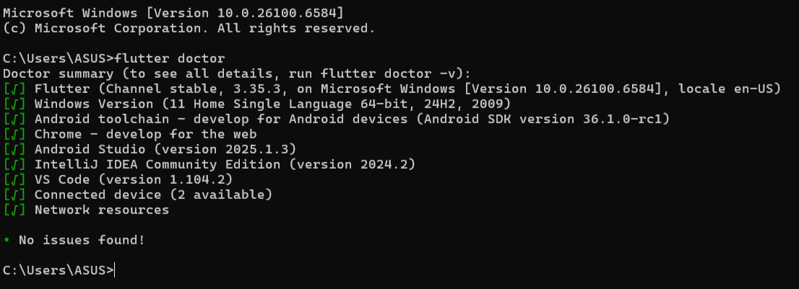


# 2. Creating a flutter project

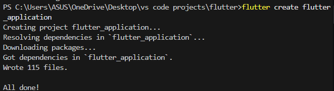

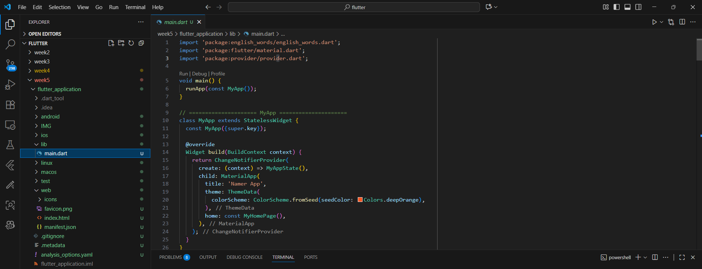


# showing the pubspec.yaml : 

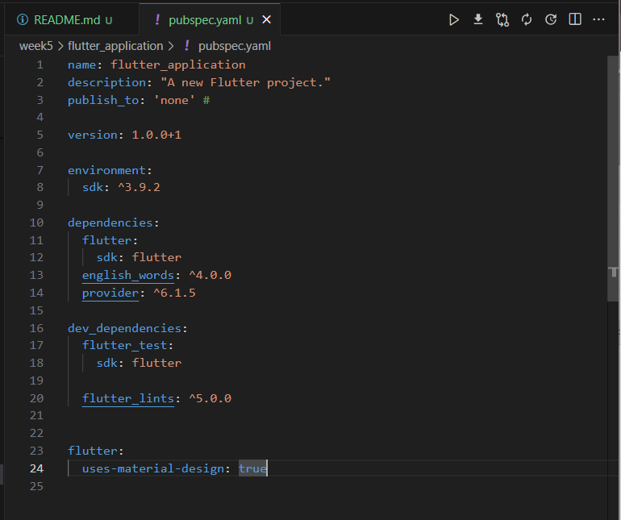

# showing the main.dart : 

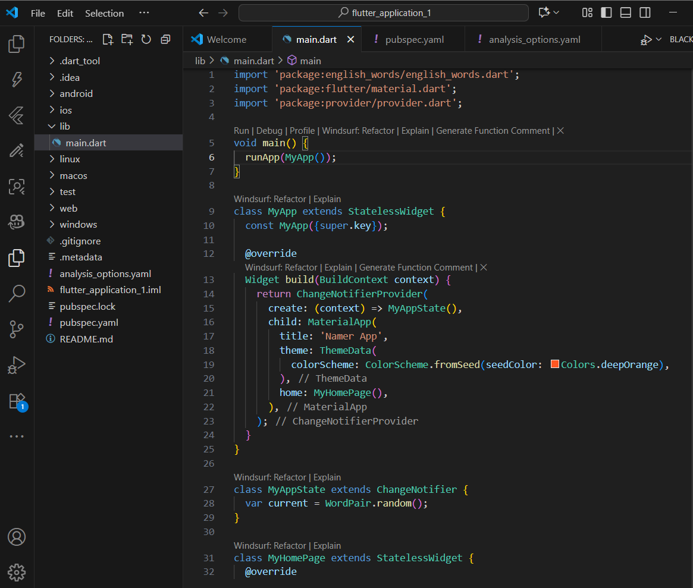


# 4. Add a button

## first we will Launch the app with random text: 


## in Hot Reload : 

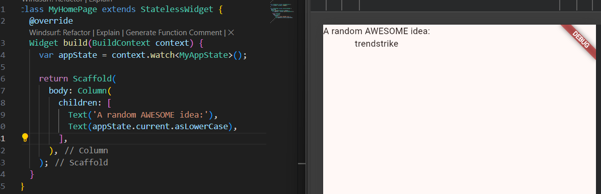

## Adding a button : 

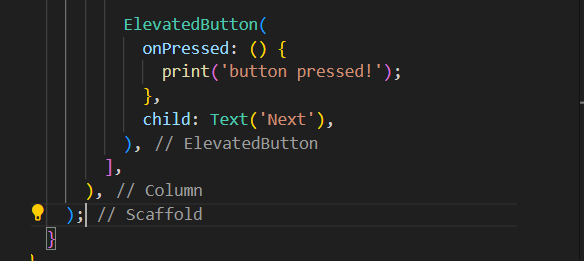

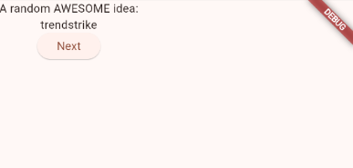


## Result of AppState and add a getNext method : : 

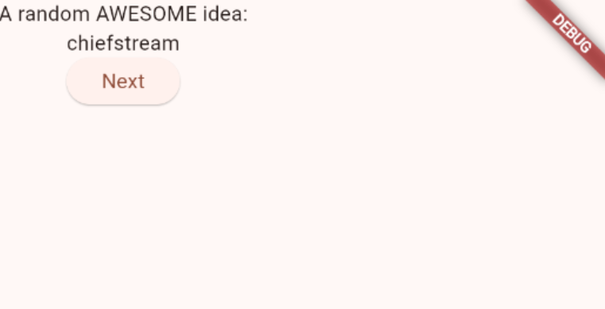
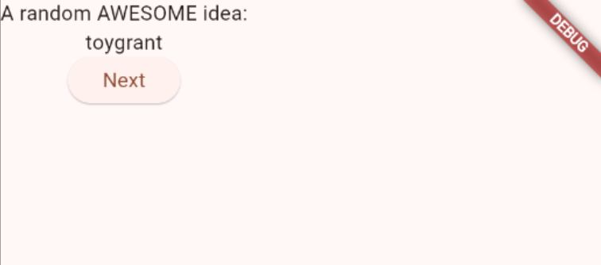

Here , every time i click next , a random word will be generated

# 5. how to Make the web looks more interesting

## Extract a widget :

```dart
 widget build(BuildContext context) {
    var appState = context.watch<MyAppState>();
    var pair = appState.current;

    return Scaffold(
      body: Column(
        children: [
          Text('A random AWESOME idea:'),
          Text(pair.toLowerCase()),

          ElevatedButton(
            onPressed: () {
              appState.getNext();
            },
            child: Text('Next'),
          ), // ElevatedButton
        ],
      ), // Column
    ); // Scaffold
  }
```

## Adding a Card : 

```dart
Widget build(BuildContext context) {
    return Padding(
      padding: const EdgeInsets.all(8.0),
      child: Text(pair.toLowerCase()),
    ); // Padding
  }
```

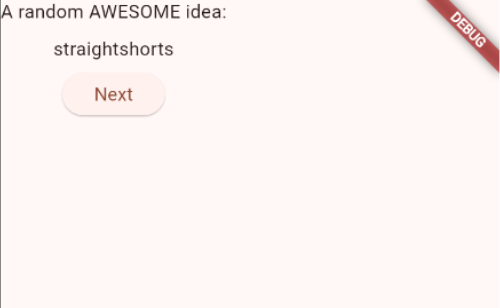

### padding 20 :


## Wrap with widget : 

``` dart 
  Widget build(BuildContext context) {
    return Card(
      child: Padding(
        padding: const EdgeInsets.all(20.0),
        child: Text(pair.toLowerCase()),
      ), // Padding
    ); // Card
  }
```

## using Theme and styling : 

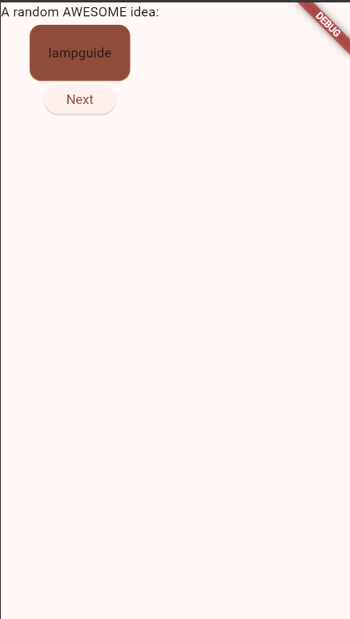

## using Text Theme :

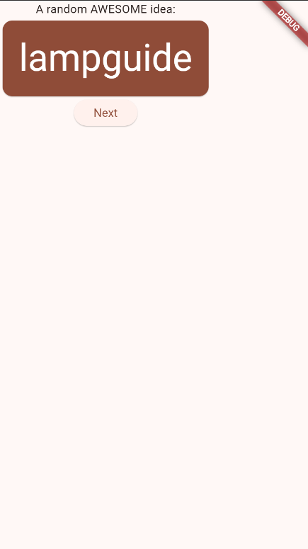

## Improve accessibility : 

```dart
widget build(BuildContext context) {
    final theme = Theme.of(context);
    final style = theme.textTheme.displayMedium!.copyWith(
      color: theme.colorScheme.onPrimary,
    );
    return Card(
      color: theme.colorScheme.primary,
      child: Text(
        pair.toLowerCase,
        style: style,
        semanticsLabel: "${pair.first} ${pair.second}",
      ), // Text
    ); // Card
}
```

## putting the UI in the center :

``` dart 
Widget build(BuildContext context) {
    var appState = context.watch<MyAppState>();
    var pair = appState.current;

    return Scaffold(
      body: Column(
        mainAxisAlignment: MainAxisAlignment.center, // <- Add this.
        children: [
          Text('A random AWESOME idea:'),
          BigCard(pair: pair),
          ElevatedButton(
            onPressed: () {
              appState.getNext();
            },
            child: Text('Next'),
          ), // ElevatedButton
        ],
      ), // Column
    ); // Scaffold
  }
```
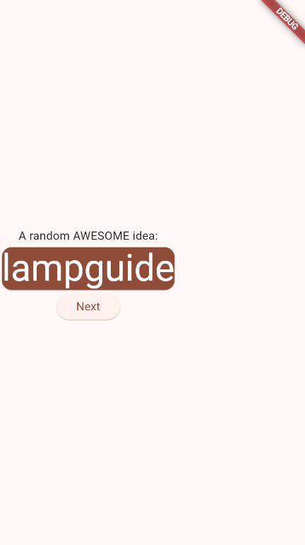

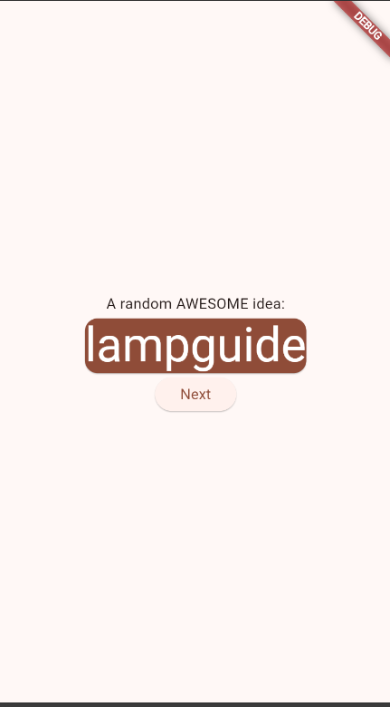


# 6. Add functionality

```dart
var favorites = <WordPair>[];

void toggleFavorite() {
  if (favorites.contains(current)) {
    favorites.remove(current);
  } else {
    favorites.add(current);
  }
  notifyListeners();
}
```

## Adding a button :

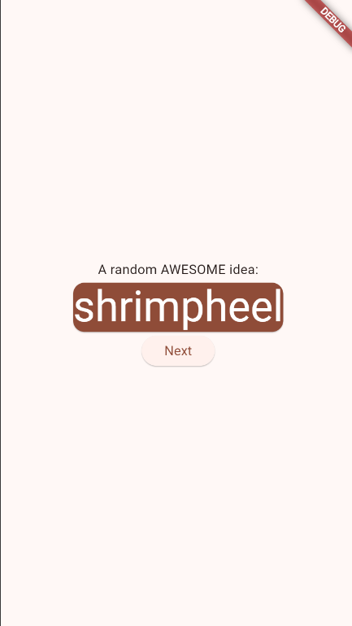

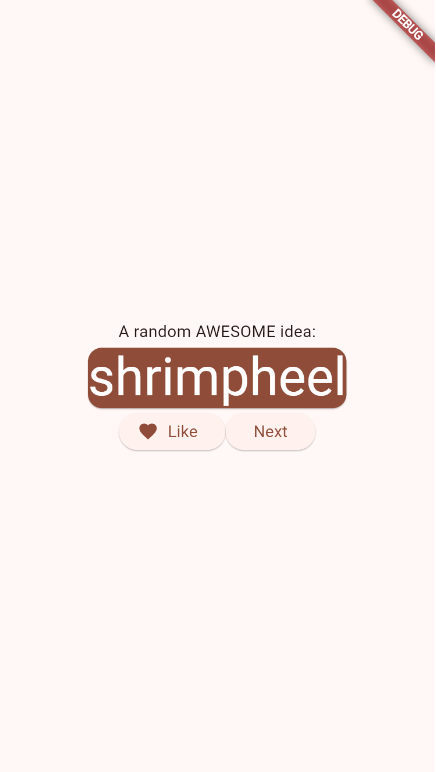


# 7. Add navigation rail

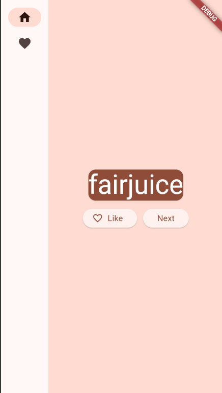

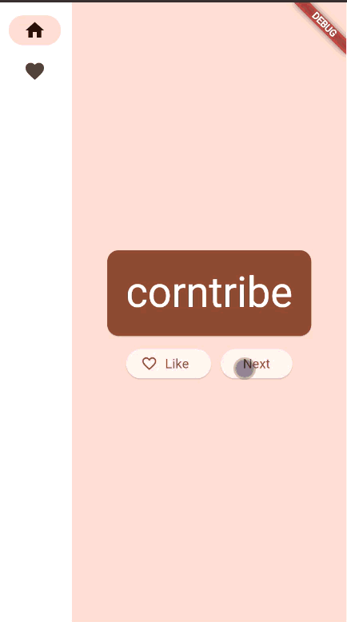

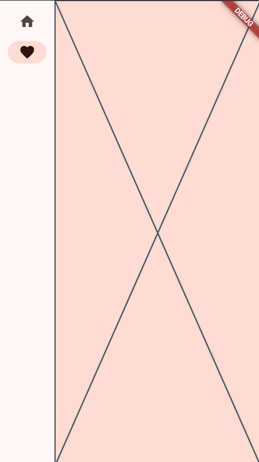

```dart 
return LayoutBuilder(
  builder: (context, constraints) {
    return Scaffold(
      body: Row(
        children: [
          // ==== NavigationRail ====
          SafeArea(
            child: NavigationRail(
              extended: false,
              destinations: const [
                NavigationRailDestination(
                  icon: Icon(Icons.home),
                  label: Text('Home'),
                ), // NavigationRailDestination
                NavigationRailDestination(
                  icon: Icon(Icons.favorite),
                  label: Text('Favorites'),
                ), // NavigationRailDestination
              ],
              selectedIndex: selectedIndex,
```


## the Final result :


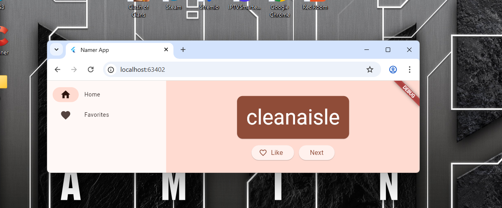
## the code for the Final result :

```dart
class FavoritesPage extends StatelessWidget {
  const FavoritesPage({super.key});

  @override
  // Windsurf: Refactor | Explain | Generate Function Comment | X
  Widget build(BuildContext context) {
    var appState = context.watch<MyAppState>();

    if (appState.favorites.isEmpty) {
      return const Center(
        child: Text('No favorites yet.', style: TextStyle(fontSize: 18)),
      ); // Center
    }

    return Column(
      crossAxisAlignment: CrossAxisAlignment.start,
      children: [
        Padding(
          padding: const EdgeInsets.all(20),
          child: Text(
            'You have ${appState.favorites.length} favorites:',
            style: const TextStyle(fontSize: 18, fontWeight: FontWeight.bold),
          ),
        ), // Padding
        Expanded(
          child: ListView.builder(
            itemCount: appState.favorites.length,
            itemBuilder: (context, index) {
              final pair = appState.favorites[index];
              return ListTile(
                leading: const Icon(Icons.favorite, color: Colors.red),
                title: Text(pair.toLowerCase),
              ); // ListTile
            },
          ), // ListView.builder
        ), // Expanded
      ],
    ); // Column
  }
}
```