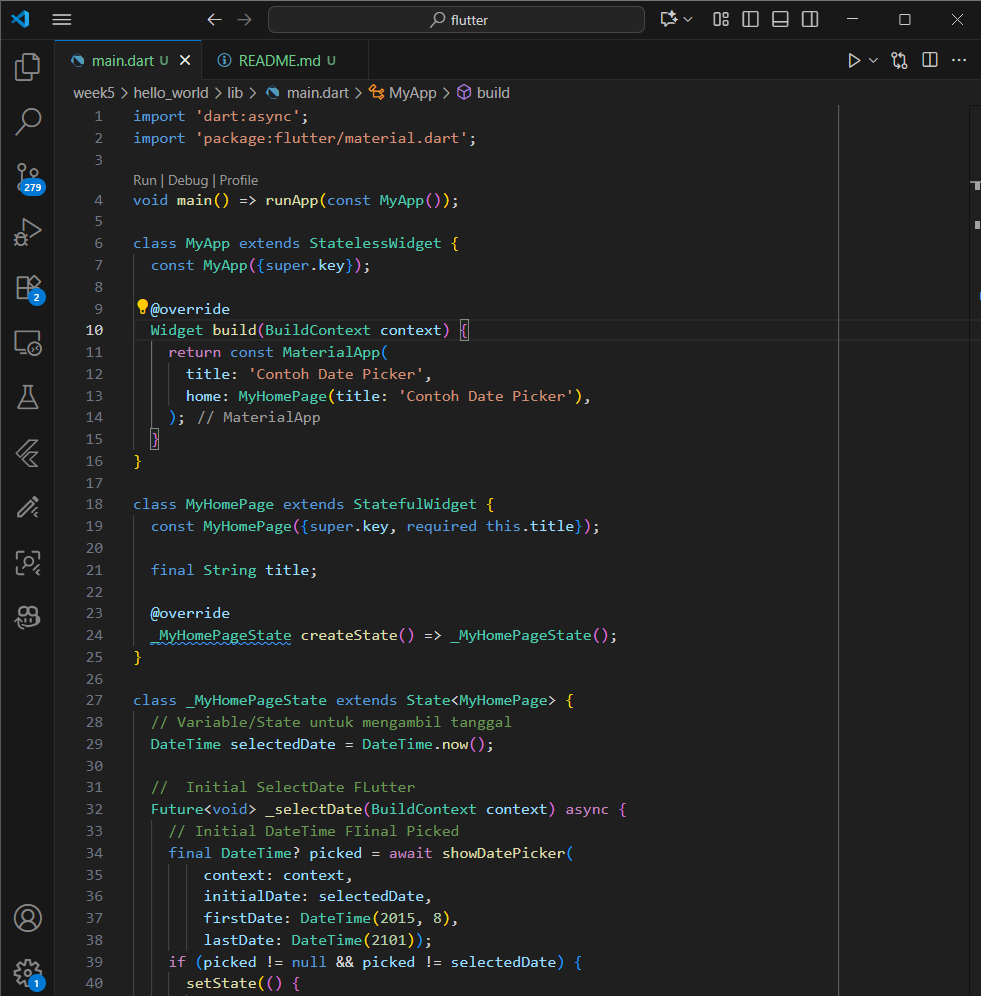
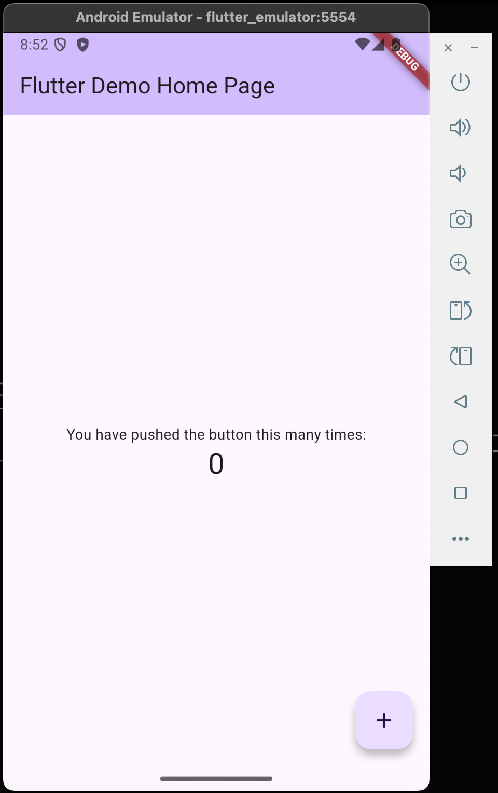
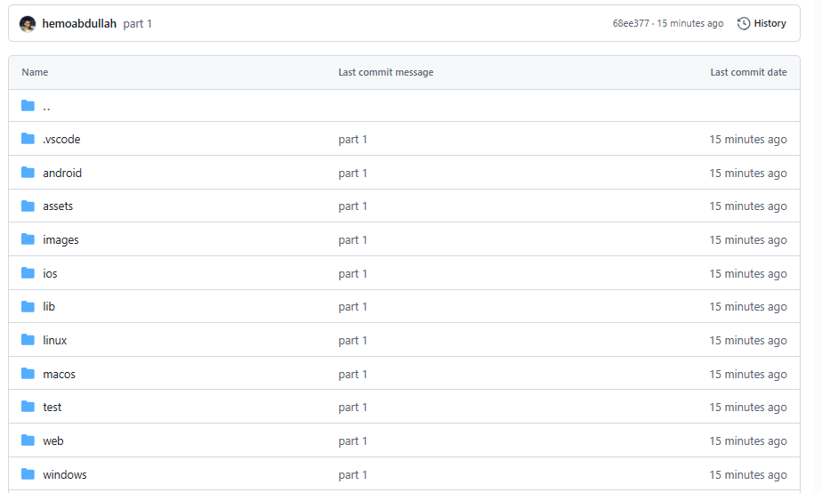
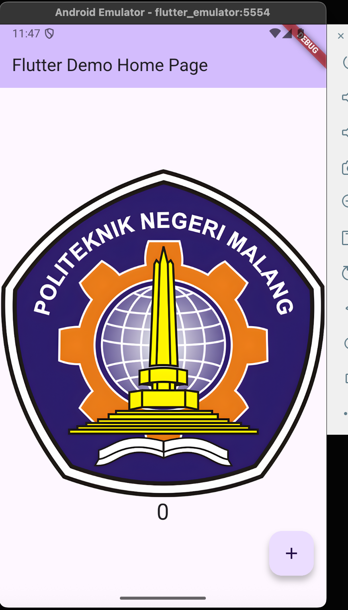
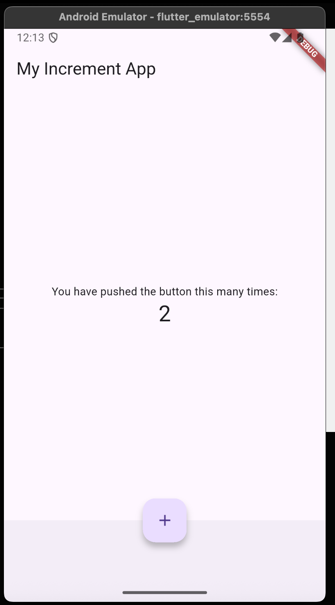
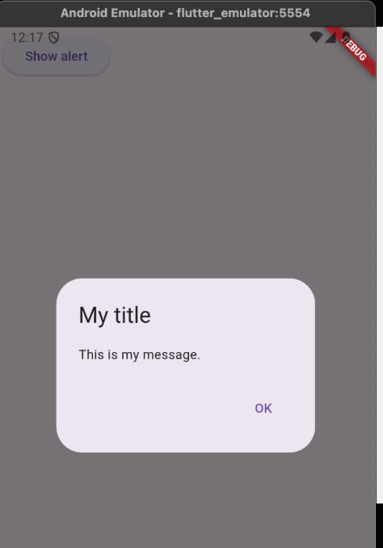
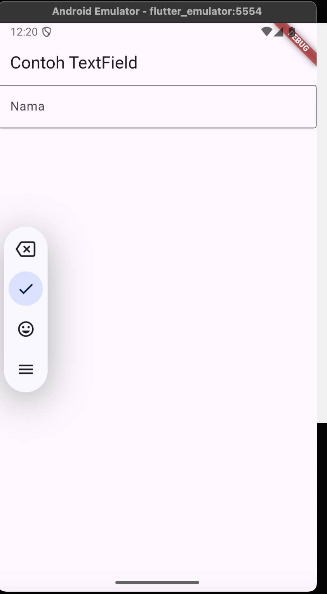
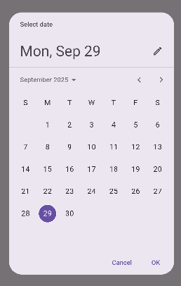

# Flutter Practicum Results

### 1. Selesaikan Praktikum 1 sampai 5, lalu dokumentasikan dan push ke repository Anda berupa screenshot setiap hasil pekerjaan beserta penjelasannya di file README.md!

## Practicum 1
Code:
```dart
import 'package:flutter/material.dart';

void main() {
  runApp(const MyApp());
}

class MyApp extends StatelessWidget {
  const MyApp({super.key});

  @override
  Widget build(BuildContext context) {
    return const MaterialApp(
      home: Scaffold(
        body: Center(
          child: Text("contoh"),
        ),
      ),
    );
  }
}
``` 



## Practicum 2
Because my phone is iphone i used android emulator from android studio 

```dart 
// Just running the default Flutter counter app on Android emulator
import 'package:flutter/material.dart';

void main() {
  runApp(const MyApp());
}

class MyApp extends StatelessWidget {
  const MyApp({super.key});

  @override
  Widget build(BuildContext context) {
    return MaterialApp(
      title: 'Flutter Demo',
      theme: ThemeData(primarySwatch: Colors.blue),
      home: const MyHomePage(title: 'Flutter Demo Home Page'),
    );
  }
}
```



## Praktikum 3 

Answer : 

```
All Pushed and running in both android and chrome 
```


## Practicum 4

### creating a Text Widget


### creating a Image Widget
``` dart 
import 'package:flutter/material.dart';

class MyTextWidget extends StatelessWidget {
  const MyTextWidget({super.key});

  @override
  Widget build(BuildContext context) {
    return const Text(
      "Nama saya Hammam, sedang belajar Pemrograman Mobile",
      style: TextStyle(color: Colors.red, fontSize: 14),
      textAlign: TextAlign.center,
    );
  }
}
```
Answer: 
```
This code creates a custom widget `MyTextWidget` that shows text.
It uses `StatelessWidget`, meaning the text won’t change after being built.
Inside `build()`, it returns a red `Text` with font size 14, centered on screen.
When used in `main.dart`, it will display: *“Nama saya Hammam, sedang belajar Pemrograman Mobile”*.
```

## Practicum 5

### Loading Cupertino Widget


### creating a Fab Cupertino Widget

Explain: 
```
“I encountered an error when running main.dart with the provided fab_widget.dart, so I replaced it with my own custom FAB while keeping Cupertino design.”

“The original fab_widget.dart caused errors in main.dart, so I created a new FAB component of my own, still using Cupertino elements.”

“Due to errors with fab_widget.dart when running main.dart, I modified the code and implemented my own Cupertino-based FAB.”
```

### Scaffolding Widget

```dart 
Scaffold(
  backgroundColor: Colors.pink[50],
  appBar: AppBar(title: const Text("My Increment App")),
  body: Center(
    child: Column(
      mainAxisAlignment: MainAxisAlignment.center,
      children: <Widget>[
        const Text('You have pushed the button this many times:'),
        Text('$_counter',
            style: Theme.of(context).textTheme.headlineMedium),
      ],
    ),
  ),
  floatingActionButton: FloatingActionButton(
    onPressed: _incrementCounter,
    child: const Icon(Icons.add),
  ),
)

```


### Dialog Widget

```dart
CupertinoButton(
  child: const Text("Show alert"),
  onPressed: () {
    showCupertinoDialog(
      context: context,
      builder: (context) {
        return CupertinoAlertDialog(
          title: const Text("My title"),
          content: const Text("This is my message."),
          actions: [
            CupertinoDialogAction(
              child: const Text("OK"),
              onPressed: () {
                Navigator.of(context).pop();
              },
            ),
```



### Text Field Widget
```dart
  @override
  Widget build(BuildContext context) {
    return MaterialApp(
      home: Scaffold(
        appBar: AppBar(
          title: const Text("Contoh TextField"),
        ),
        body: const Padding(
          padding: EdgeInsets.all(16.0),
          child: TextField(
            decoration: InputDecoration(
              labelText: "Nama",
              border: OutlineInputBorder(),
            ),
  }
}
```



### Datetime Picker Widget

