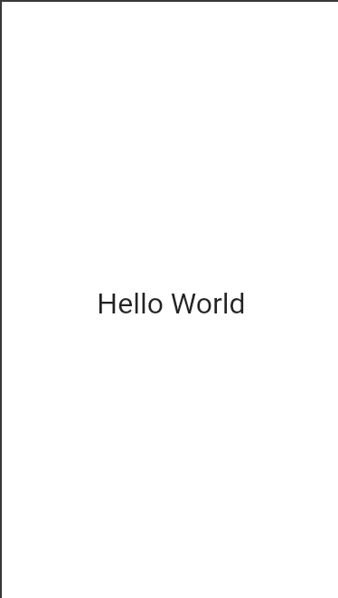
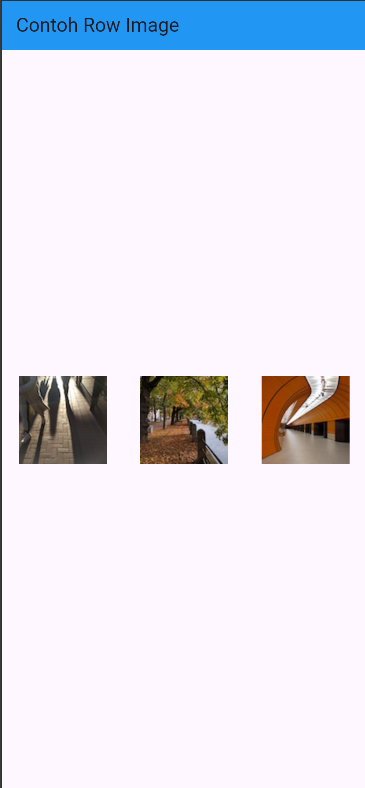
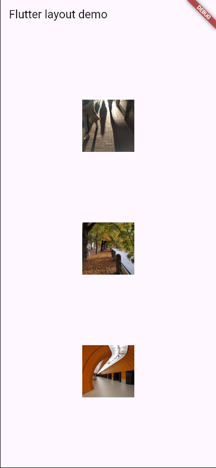
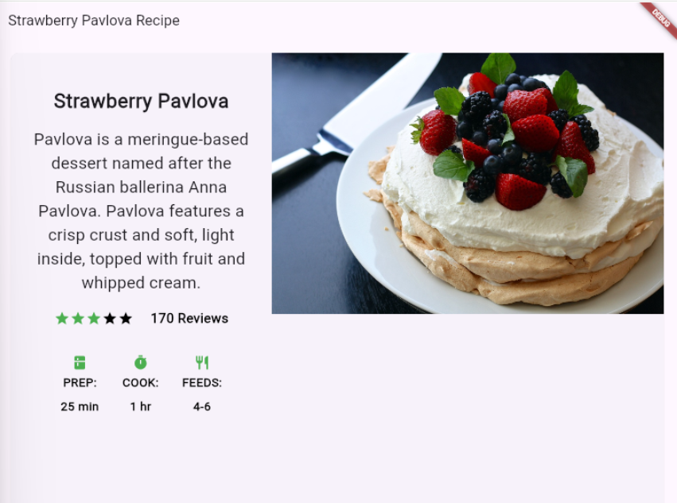
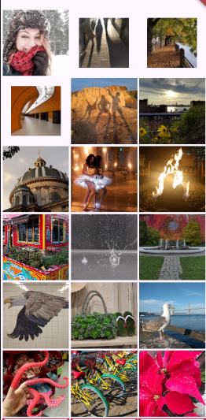
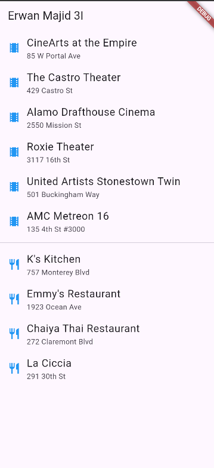
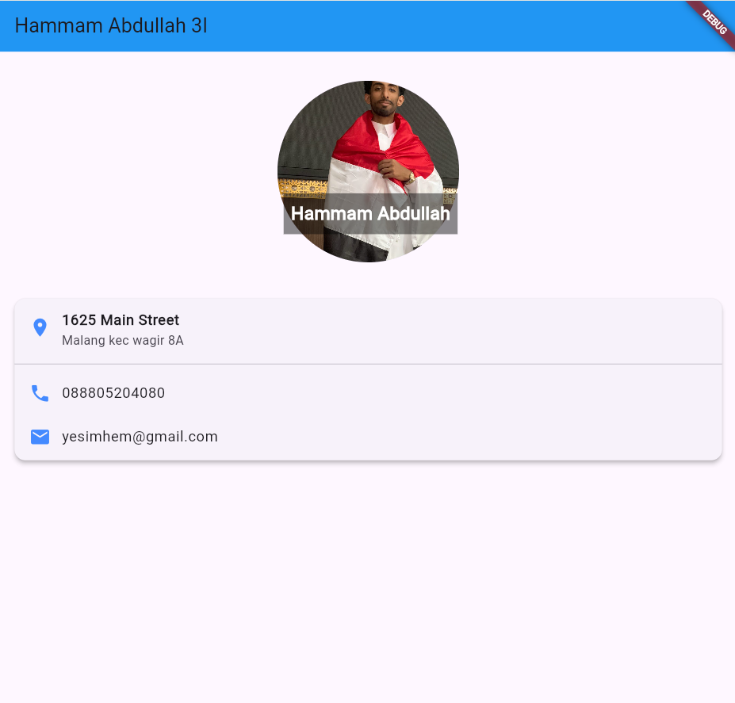

# widget Layout
### Hello world


# Lay out multiple widgets vertically and horizontally

```dart
import 'package:flutter/material.dart';

void main() => runApp(const MyApp());

class MyApp extends StatelessWidget {
  const MyApp({super.key});

  @override
  Widget build(BuildContext context) {
    return MaterialApp(
      debugShowCheckedModeBanner: false,
      home: Scaffold(
        appBar: AppBar(
          title: const Text('Contoh Row Image'),
          backgroundColor: Colors.blue,
        ), //, // AppBar
        body: Center(
          child: Row(
            mainAxisAlignment: MainAxisAlignment.spaceEvenly,
            children: const [
              Expanded(child: Image(image: AssetImage('images/pic1.jpg'))),
              Expanded(child: Image(image: AssetImage('images/pic2.jpg'))),
              Expanded(child: Image(image: AssetImage('images/pic3.jpg'))),
            ],
          ), //, // Row
        ), //, // Center
      ), //, // Scaffold
    ); //, // MaterialApp
  }
}
```
### explain:
This code creates a Flutter application featuring a Scaffold that includes a blue AppBar. The body of the app contains a Row centered on the screen. The Row utilizes the Expanded widget, allowing each of the three images to occupy equal space, while MainAxisAlignment.spaceEvenly ensures they are evenly distributed across the screen.





# Sizing widgets

```dart
Widget buildExpandedImages() {
  // #docregion expanded-images
  return Row(
    crossAxisAlignment: CrossAxisAlignment.center,
    children: [
      Expanded(child: Image.asset('images/pic1.jpg')),
      Expanded(child: Image.asset('images/pic2.jpg')),
      Expanded(child: Image.asset('images/pic3.jpg')),
    ],
  ); // Row
  // #enddocregion expanded-images
}
```

### Explanation:
This function creates a Row containing three images arranged side by side. Each image is enclosed in an Expanded widget, allowing them to occupy equal space. The Row also centers them vertically using crossAxisAlignment.center.


# Pavlova

### The Code:
```dart
import 'package:flutter/material.dart';
import 'package:flutter/rendering.dart' show debugPaintSizeEnabled;

void main() => runApp(const MyApp());
class MyApp extends StatelessWidget {
  const MyApp({super.key});

  // Widget: Foto + Nama
  Widget _buildStack() {
    return Stack(
      alignment: const Alignment(0.6, 0.6),
      children: [
        const CircleAvatar(
          backgroundImage: AssetImage('images/1.JPG'),
          radius: 100,
        ),
        Container(
          decoration: const BoxDecoration(color: Colors.black45),
          padding: const EdgeInsets.all(8),
          child: const Text(
            'Hammam Abdullah',
            style: TextStyle(
              fontSize: 20,
              fontWeight: FontWeight.bold,
              color: Colors.white,
            ),
          ),
        ),
      ],
    );
  }

  @override
  Widget build(BuildContext context) {
    return MaterialApp(
      home: Scaffold(
        appBar: AppBar(
          title: const Text('Hammam Abdullah 3I'),
          backgroundColor: Colors.blue,
        ),
        body: ListView(
          children: [
            const SizedBox(height: 32),
            Center(child: _buildStack()),
            const SizedBox(height: 24),
            _buildCard(),
          ],
        ),
      ),
    );
  }
}

```

 recipe page that includes a title, description, star ratings, and cooking information. On wider screens, it presents an image alongside the details, while on narrower screens, it stacks them. The layout is designed to be responsive using LayoutBuilder. Additionally, the content is enclosed in a Card with rounded corners and elevation, giving it a polished material design appearance.

# Responsive Pavlova


## The Code:
``` dart 
Widget buildHomePage(String title) {
  // #docregion icon-list
  // ... (iconList definition from previous image/context)

  // #docregion left-column
  final leftColumn = Container(
    padding: const EdgeInsets.fromLTRB(20, 30, 20, 20),
    child: Column(children: [titleText, subTitle, finalRatings, finalIconList]),
  );
  // #enddocregion left-column

  final mainImage = Image.asset('images/pavlova.jpg', fit: BoxFit.cover);

  return Scaffold(
    appBar: AppBar(title: Text(title)),
    body: Center(
      child: LayoutBuilder(
        builder: (context, constraints) {
          bool isWideScreen = constraints.maxWidth > 600;

          final content = isWideScreen
              ? Row(
                  crossAxisAlignment: CrossAxisAlignment.start,
                  children: [
                    Expanded(child: leftColumn),
                    Expanded(child: mainImage),
                  ],
                )
              : Column(
                  crossAxisAlignment: CrossAxisAlignment.stretch,
                  children: [mainImage, leftColumn],
                );

          return Container(
            margin: const EdgeInsets.all(16),
            child: Card(
              elevation: 5,
              shape: RoundedRectangleBorder(
                borderRadius: BorderRadius.circular(16),
              ),
              child: SingleChildScrollView(child: content),
            ), // Card
          ); // Container
        },
      ), // LayoutBuilder
    ), // Center
  ); // Scaffold
}
```
### Explanation:
The layout is responsive as it utilizes LayoutBuilder. It evaluates the screen width (constraints.maxWidth > 600) and alternates between a Row layout for wider screens (side-by-side arrangement) and a Column layout for narrower screens (stacked arrangement). The Card widget surrounds the content, providing elevation (shadow), rounded corners, and a material design appearance to the layout.

# Grid Gallery


## The code: 
``` dart
  Widget build(BuildContext context) {
    return MaterialApp(
      title: 'Flutter layout demo',
      home: Scaffold(
        appBar: AppBar(title: const Text('Hammam Abdullah 3I')),
        body: Center(child: showGrid ? _buildGrid() : _buildList()),
      ), // Scaffold
    ); // MaterialApp
  }
// #docregion grid
Widget _buildGrid() => GridView.extent(
      maxCrossAxisExtent: 150,
      padding: const EdgeInsets.all(4),
      mainAxisSpacing: 4,
      crossAxisSpacing: 4,
      children: _buildGridTileList(30),
    );


List<Widget> _buildGridTileList(int count) => List.generate(
      count,
      (i) => Image.asset('images/pic$i.jpg'),
    );
```
### Explanation:

This step shows two layouts: a grid and a list. By default, the showGrid option is true, which means the main display is a GridView with images organized in tiles, with each image sourced from the assets. If showGrid is set to false, it will show a ListView of locations, such as theaters and restaurants, with each location represented by a ListTile that includes a title, subtitle, and icon.


 # ListView
 
### The Code:
``` dart
 @override
  Widget build(BuildContext context) {
    return MaterialApp(
      title: 'Flutter layout demo',
      home: Scaffold(
        appBar: AppBar(title: const Text('Hammam Abdullah 3I')),
        body: Center(child: showGrid ? _buildGrid() : _buildList()),
      ), // Scaffold
    ); // MaterialApp
  }

Widget _buildList() {
  return ListView(
    children: [
      _tile('CineArts at the Empire', '85 W Portal Ave', Icons.theaters),
      _tile('The Castro Theater', '429 Castro St', Icons.theaters),
      _tile('Alamo Drafthouse Cinema', '2550 Mission St', Icons.theaters),
      _tile('Roxie Theater', '3117 16th St', Icons.theaters),
      _tile(
          'United Artists Stonestown Twin', '501 Buckingham Way', Icons.theaters),
```
 # StackWidget
 
 ## The code : 
 ```dart
  Widget _buildCard() {
    return SizedBox(
      height: 210,
      child: Card(
        elevation: 4,
        margin: const EdgeInsets.all(16),
        shape: RoundedRectangleBorder(borderRadius: BorderRadius.circular(12)),
        child: Column(
          children: const [
            ListTile(
              title: Text(
                'jalan angkawijaya',
                style: TextStyle(fontWeight: FontWeight.w600, fontSize: 16),
              ),
              subtitle: Text('Malang kec wagir 8A'),
              leading: Icon(Icons.location_on, color: Colors.blueAccent),
            ),
            Divider(),
            ListTile(
              title: Text(
                '088805204080',
                style: TextStyle(fontWeight: FontWeight.w500),
              ),
              leading: Icon(Icons.phone, color: Colors.blueAccent),
            ),
            ListTile(
              title: Text('yesimhem@gmail.com'),
              leading: Icon(Icons.email, color: Colors.blueAccent),
            ),
          ],
 ```

## The result:

 

The layout features a profile-style design along with a basic counter demonstration. At the top, there is a custom Stack that displays a circular profile image with the name "Hammam Abdullah, semi-transparent black box. Below this, a Card presents contact details, including address, phone number, and email, each represented by a ListTile with accompanying icons. The entire layout is organized in a ListView to allow for scrolling if necessary.

Additionally, the code incorporates Flutter’s standard counter example using a StatefulWidget (MyHomePage). This section shows a number that increments each time the floating action button is clicked. The setState method is used to update the UI with the new counter value. Overall, the code showcases both a static layout design (Stack and Card) and dynamic state management (counter).