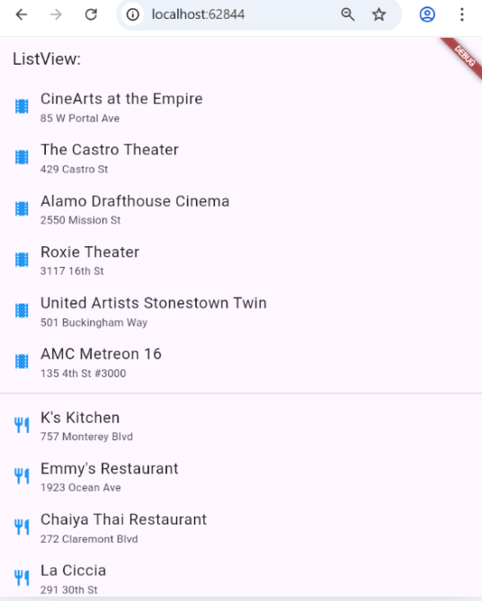

# Lay out a widget

Hello World

Standard hello world

# Lay out multiple widgets vertically and horizontally

This code builds a Flutter app with a Scaffold that has a blue AppBar and a body containing a Row inside a Center. The Row uses Expanded so each of the three images takes equal space, and MainAxisAlignment.spaceEvenly makes them spread evenly across the screen

# Sizing widgets

This function builds a Row with three images placed horizontally. Each image is wrapped in an Expanded widget so they share equal space, and the Row aligns them vertically in the center with crossAxisAlignment.center

This function builds a Row with three images, each inside an Expanded widget. The second image has a flex value of 2, so it takes up twice as much horizontal space as the other two images, while all remain vertically centered

# Packing widgets

This function creates a Row of star icons with a minimum width. It shows three green stars followed by two black stars, useful for displaying a simple rating indicator

This widget builds a ratings section inside a Container with padding. It uses a Row to place the custom starRow() on the left and the text “170 Reviews” on the right, spaced evenly. The text is styled with bold, black Roboto font, letter spacing, and size 20

# Pavlova

This app displays a recipe page with a title, description, rating stars, and cooking info. It shows an image and details side by side on wide screens, or stacked on narrow screens, using LayoutBuilder for responsiveness. The content is wrapped in a Card with rounded corners and elevation for a clean material look

# Responsive Pavlova

Responsive because it uses LayoutBuilder. It checks the available screen width (constraints.maxWidth > 600) and switches between a Row (wide screen, side-by-side) and a Column (narrow screen, stacked).
The Card comes from the Card widget wrapping the content. It gives elevation (shadow), rounded corners, and a material look to the layout.

# GridView

This app shows a layout demo with images arranged in a column. The column contains two rows, and each row has two images. Every image is wrapped in a decorated container with borders, rounded corners, and margins, then expanded so they share equal space. The background of the column is set to a light black color

# Grid Gallery

 This app demonstrates two layouts: a grid and a list. By default, showGrid is set to true, so the body shows a GridView with images arranged in tiles, each image loaded from assets. If set to false, it displays a ListView of places (theaters and restaurants), each represented by a ListTile with a title, subtitle, and icon. The Scaffold provides an AppBar with the title “Erwan Majid 3I.

 # ListView
 
 

 This app displays a layout demo with an AppBar titled “Erwan Majid 3I.” Because showGrid is set to false, the body shows a ListView of theaters and restaurants. Each item is built with a ListTile containing a title, subtitle, and an icon, with a divider separating the two groups. If showGrid were set to true, it would instead show a GridView of images loaded from assets

 # StackWidget
  
    

builds a profile-style layout combined with a simple counter demo. At the top, it shows a custom Stack: a circular profile image with the name “Erwan Majid” overlaid in a semi-transparent black box. Below that, it displays a Card containing contact information such as address, phone number, and email, each represented with a ListTile and icons. The overall layout is arranged in a ListView so it can scroll if needed.
Additionally, the code still includes Flutter’s default counter example with a StatefulWidget (MyHomePage). This part shows a number that increases every time the floating action button is pressed. The setState method ensures the UI updates to reflect the new counter value. Together, the code demonstrates both static layout design (Stack and Card) and dynamic state management (counter)