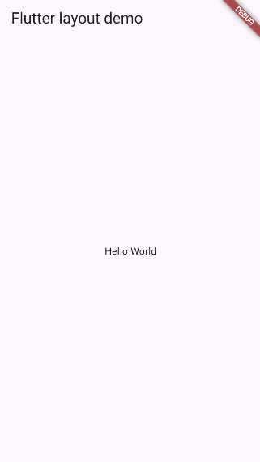
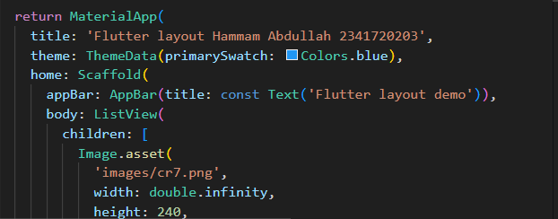
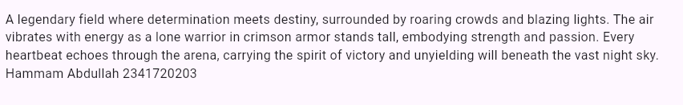
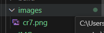
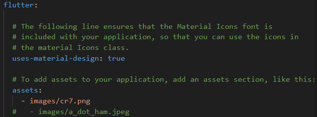
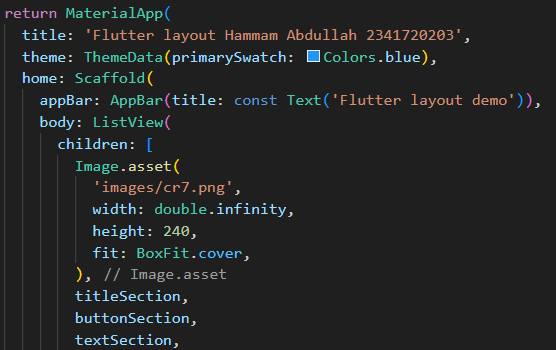
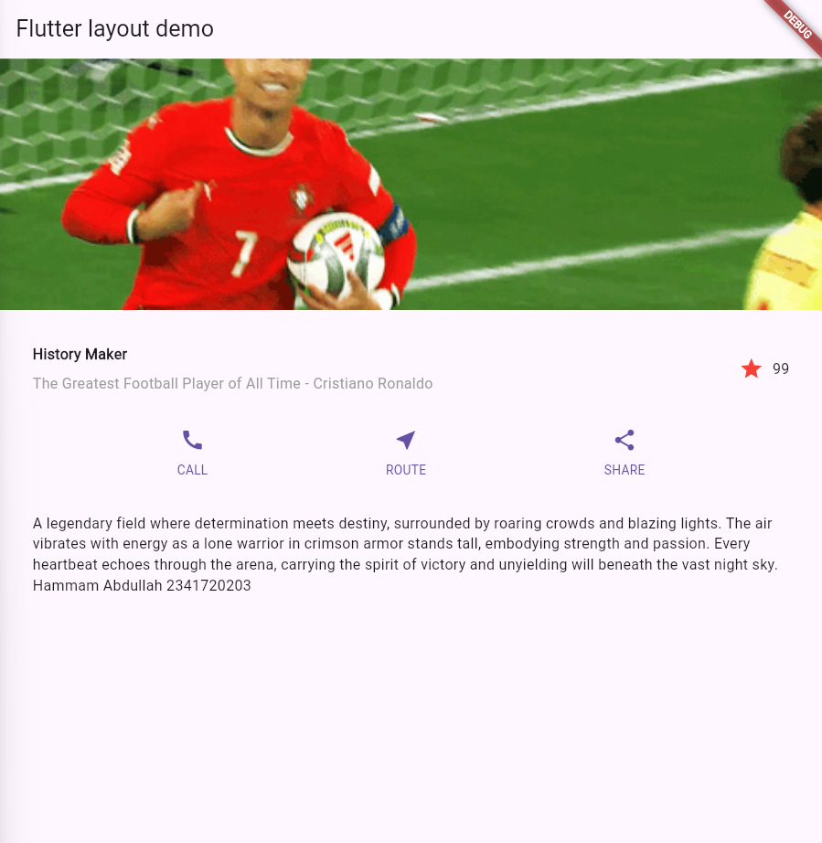

 # 06 | Layout dan Navigasi


# Practicum 1
Langkah 1: Buat Project Baru Buatlah sebuah project flutter baru dengan nama layout_flutter. Atau sesuaikan style laporan praktikum yang Anda buat.

Langkah 2: Buka file lib/main.dart Buka file main.dart lalu ganti dengan kode berikut. Isi nama dan NIM Anda di text title.
```dart 
import 'package:flutter/material.dart';

void main() => runApp(const MyApp());

class MyApp extends StatelessWidget {
  const MyApp({super.key});

  @override
  Widget build(BuildContext context) {
    return MaterialApp(
      title: 'Flutter layout: Nama dan NIM Anda',
      home: Scaffold(
        appBar: AppBar(
          title: const Text('Flutter layout demo'),
        ),
        body: const Center(
          child: Text('Hello World'),
        ),
      ),
    );
  }
}
```
## starting the app


# Practicum 2
## first:
```dart
Column _buildButtonColumn(Color color, IconData icon, String label) {
  return Column(
    mainAxisSize: MainAxisSize.min,
    mainAxisAlignment: MainAxisAlignment.center,
    children: [
      Icon(icon, color: color),
      Container(
        margin: const EdgeInsets.only(top: 8),
        child: Text(
          label,
          style: TextStyle(
            fontSize: 12,
            fontWeight: FontWeight.w400,
            color: color,
          ), //, // TextStyle
        ), //, // Text
      ), //, // Container
    ],
  ); //, // Column
}
```

## then we add the code for the 3 Buttons:
```dart
Color color = Theme.of(context).primaryColor;

// buttonSection: baris yang berisi 3 kolom tombol
Widget buttonSection = Row(
  mainAxisAlignment: MainAxisAlignment.spaceEvenly,
  children: [
    _buildButtonColumn(color, Icons.call, 'CALL'),
    _buildButtonColumn(color, Icons.near_me, 'ROUTE'),
    _buildButtonColumn(color, Icons.share, 'SHARE'),
  ],
);
```

# Practicum 3

### Adding name and a NIM:


### Adding a text section below the buttons:


# Practicum 4

### Langkah 1: Siapkan aset gambar:


### Langkah 2: Tambahkan gambar ke body:

### Langkah 3: Terakhir, ubah menjadi ListView:


Explanation of how does code works:
This Flutter code is all about building one structured, scrollable screen. It uses a ListView so you can scroll past the big image at the top. The layout starts with a titleSection, which is a Row that splits the space: on the left, you get the bold title and address in a Column, and on the right, there's a simple red star rating.

Right beneath that is the buttonSection, a horizontally spaced Row that creates those three functional buttons—CALL, ROUTE, and SHARE—by stacking an icon and a label. Finally, the textSection is a large, descriptive paragraph that's set to wrap nicely on any screen. Basically, it’s a clean demonstration of how to combine Flutter’s fundamental widgets (Container, Row, Column) into a professional, mobile-friendly design, all contained within a Scaffold for the final app screen.

## Result:


