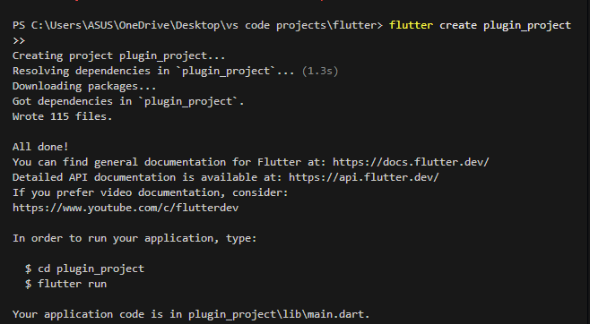
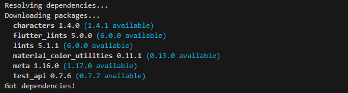
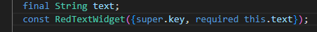
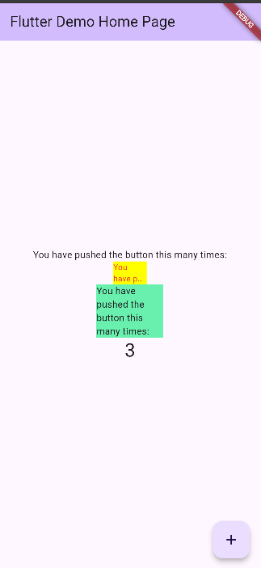

# Step 1: Creating a New Plugin Project



# Step 2: Checking after adding plugins:



# Step 3: Create a red_text_widget.dart file

``` dart 
import 'package:flutter/material.dart';

class RedTextWidget extends StatelessWidget {
  const RedTextWidget({super.key});

  @override
  Widget build(BuildContext context) {
    return Container();
  }
}
```
*in lib-red_text.... *

# Step 4: Add AutoSizeText Widget to the code:

``` dart
import 'package:flutter/material.dart';

class RedTextWidget extends StatelessWidget {
  const RedTextWidget({super.key});

  @override
  Widget build(BuildContext context) {
    return AutoSizeText(
      text,
      style: const TextStyle(color: Colors.red, fontSize: 14),
      maxLines: 2,
      overflow: TextOverflow.ellipsis,
    );
  }
}
```
### output:
i got an error here , 
 Why is that? 
- The text parameter is undefined: The variable 'text' is referenced but has not been declared or provided through the constructor. Flutter is unable to determine what value to show.
- The auto_size_text plugin is not imported: AutoSizeText is not a native Flutter widget. If you haven't imported it, you'll encounter an error stating "Undefined class 'AutoSizeText'."

### then: 
``` dart
import 'package:flutter/material.dart';
import 'package:auto_size_text/auto_size_text.dart';

class RedTextWidget extends StatelessWidget {
  final String text;
  const RedTextWidget({super.key, required this.text});

  @override
  Widget build(BuildContext context) {
    return AutoSizeText(
      text,
      style: const TextStyle(color: Colors.red, fontSize: 14),
      maxLines: 2,
      overflow: TextOverflow.ellipsis,
    ); // AutoSizeText
  }
}
```


# Step 5: Create Variable text and parameters in the constructor



# Step 6: Add widgets in main.dart

``` dart 
mainAxisAlignment: MainAxisAlignment.center,
children: <Widget>[
  const Text('You have pushed the button this many times:'),
  Container(
    color: Colors.yellowAccent,
    width: 50,
    child: const RedTextWidget(
      text: 'You have pushed the button this many times:',
    ), // RedTextWidget
  ), // Container

  // ♦ Bandingkan dengan Text biasa
  Container(
    color: Colors.greenAccent,
    width: 100,
    child: const Text('You have pushed the button this many times:'),
  ), // Container
  // ♦ Counter display
  Text(
    '$_counter',
    style: Theme.of(context).textTheme.headlineMedium,
  ), // Text
], // <Widget>[]
), // Column
), // Center
floatingActionButton: FloatingActionButton(
  onPressed: _incrementCounter,
  tooltip: 'Increment',
  child: const Icon(Icons.add),
), // FloatingActionButton
); // Scaffold
```

# Showing The Result



# Practicum Assignments

# 2. Explain the purpose of step 2 in the practicum!

The goal of Step 2 is to add the auto_size_text plugin to the Flutter project.
This plugin provides the AutoSizeText widget, which is not included in Flutter’s default library. Its main function is to make text automatically resize so it fits neatly within its container, preventing overflow or clipping.

By running the command:
``` dart
flutter pub add auto_size_text
```
the dependency is added to the pubspec.yaml file, and Flutter downloads the necessary package files.
After this step, the project can use the AutoSizeText widget to display text that adjusts its size automatically, resulting in more responsive and readable layouts on different screen sizes.

# 3. Explain the meaning of step 5 in the practicum!

The purpose of Step 5 is to allow the RedTextWidget class to receive dynamic text input instead of a fixed one.
By declaring a variable such as:
final String text;

the widget stores the text that will be displayed.
Then, through the constructor:
``` dart
const RedTextWidget({Key? key, required this.text}) : super(key: key);
```

Flutter ensures that each time this widget is created, a value for text must be provided.
This design makes the widget reusable and flexible, since it can display different text values depending on where and how it’s used in the app.

# 4. In step 6 there are two widgets added, explain the functions and the differences!

In Step 6, two widgets are added to compare their behavior when displaying text:

First Widget:
Uses the custom RedTextWidget, which internally applies the AutoSizeText plugin. This widget automatically adjusts its font size to fit the available space, keeping the text visible without overflowing.

Second Widget:
Uses Flutter’s built-in Text widget, which does not resize automatically. If the container is too small, the text may overflow or get cut off.

# 5. Explain the intent of each parameter in the plugin based on the link in this documentation!auto_size_text
| **Parameter**                                   | **Description**                                                                                                                  |
| ----------------------------------------------- | -------------------------------------------------------------------------------------------------------------------------------- |
| **`String text`**                               | The text content displayed inside the widget.                                                                                    |
| **`TextStyle style`**                           | Sets the base appearance of the text, including color, font size, and weight. The widget may adjust this style to fit the space. |
| **`int maxLines`**                              | Specifies the maximum number of lines the text can occupy before overflowing.                                                    |
| **`TextOverflow overflow`**                     | Determines what happens when the text doesn’t fit — for example, using an ellipsis (`...`) or clipping the extra text.           |
| **`double minFontSize`** *(optional)*           | Sets the smallest font size the text can shrink to, ensuring readability.                                                        |
| **`double maxFontSize`** *(optional)*           | Defines the largest font size the text can use, usually matching the initial font size in the style.                             |
| **`double stepGranularity`** *(optional)*       | Controls how much the font size decreases per step when resizing. Smaller values produce smoother adjustments.                   |
| **`bool wrapWords`** *(optional)*               | If true, allows wrapping in the middle of words; if false, wraps only at word boundaries.                                        |
| **`List<double> presetFontSizes`** *(optional)* | A list of specific font sizes the widget can try, instead of adjusting gradually.                                                |
| **`Widget overflowReplacement`** *(optional)*   | A fallback widget displayed when the text can’t fit, even after resizing (for example, a shorter text or an icon).               |
