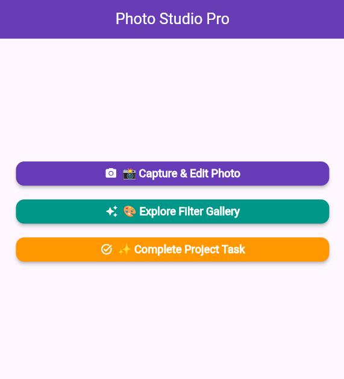
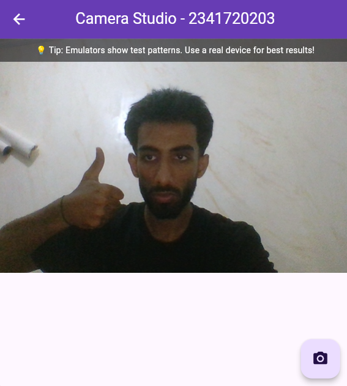
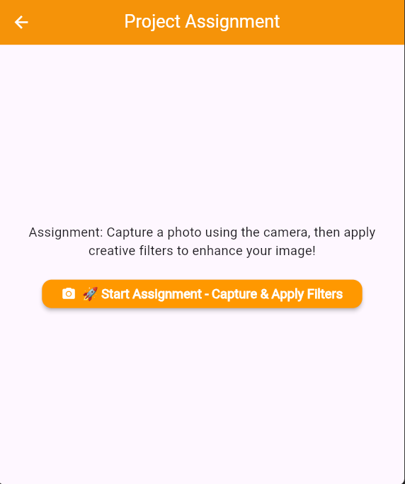
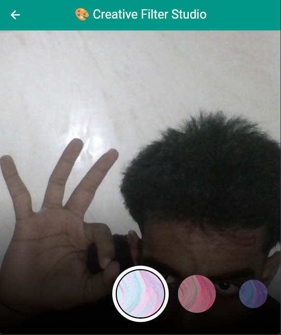

# 📸  Flutter Camera & Filter Application

---

## 📋 Table of Contents
- [Project Overview](#-project-overview)
- [Features](#-features)
- [Application Screenshots](#-application-screenshots)
- [Technical Implementation](#-technical-implementation)
- [Assignment Answers](#-assignment-answers)

---

## 🎯 Overview

**Photo Studio Pro** is a comprehensive Flutter mobile application that demonstrates advanced camera integration and real-time photo filter capabilities. This project combines camera functionality with an interactive filter carousel to create a complete photo editing experience.

### Key Objectives:
✅ Implement camera capture functionality using Flutter's `camera` plugin  
✅ Create an interactive photo filter carousel with color blend modes  
✅ Integrate camera capture with filter application workflow  
✅ Provide a seamless user experience with modern UI/UX design

---

## ✨ Features

### 1. **📸 Camera Capture System**
- Real-time camera preview
- Photo capture functionality
- Cross-platform support (Android, iOS, Web)
- Error handling for camera permissions and availability
- Simulator/Emulator detection with helpful tips

### 2. **🎨 Interactive Filter Gallery**
- Carousel-based filter selection
- Real-time filter preview
- Multiple color blend filters
- Smooth animations and transitions
- Touch-based filter navigation

### 3. **🔄 Integrated Workflow**
- Capture photo → Apply filters → Save/Share
- Seamless navigation between screens
- Live preview of filter effects
- Support for both captured and sample images

---

## 📱 Application Screenshots

### Home Screen


**Description:** The main landing screen features three primary navigation options:
- **📸 Capture & Edit Photo** - Opens the camera to take a photo and immediately apply filters
- **🎨 Explore Filter Gallery** - Browse and test different filters on sample images
- **✨ Complete Project Task** - Direct access to the assignment workflow

The home screen uses a clean, modern design with color-coded buttons for easy navigation.

---

### Camera Capture Interface


**Description:** The camera interface provides:
- Full-screen camera preview
- Floating action button for photo capture
- Information banner for simulator users
- Real-time camera feed from device
- Error handling with user-friendly messages

**Technical Note:** In emulators/simulators, you'll see test patterns instead of actual camera feed. This is expected behavior. Use a physical device for full functionality.

---

### Filter Application Screen


**Description:** The filter carousel screen showcases:
- Large preview of the captured/selected image
- Bottom carousel with multiple filter options
- Selection ring highlighting the active filter
- Real-time color blend mode application
- Smooth scrolling between filters
- Shadow gradient for better carousel visibility

**Filter Technology:** Uses Flutter's `ColorBlendMode` to apply various color overlays, creating professional-looking photo effects.

---

### Assignment Completion Screen


**Description:** Dedicated task screen that:
- Provides clear assignment instructions
- Explains the workflow (capture → filter → complete)
- Offers direct access to the camera-to-filter pipeline
- Includes professional styling matching the app theme

---

### Final Result


**Description:** This demonstrates the complete workflow result:
- Successfully captured photo
- Applied creative color filter
- Professional presentation
- Demonstrates the full capability of the integrated system

---

## 🛠️ Technical Implementation

### Architecture & Design Patterns

#### **State Management**
- `ValueNotifier<Color>` for reactive filter color updates
- `StatefulWidget` for camera controller lifecycle management
- `ValueListenableBuilder` for efficient UI rebuilds

#### **Custom Widgets**
- `CarouselFlowDelegate` - Custom `FlowDelegate` for 3D carousel effect
- `FilterSelector` - Stateful carousel with PageController
- `FilterItem` - Reusable filter thumbnail widget
- `PhotoFilterCarousel` - Main filter application screen

#### **Key Flutter Packages**
```yaml
dependencies:
  camera: ^0.10.5+9          # Camera hardware access
  permission_handler: ^11.3.1 # Runtime permissions
  path_provider: ^2.1.3       # File system paths
  cross_file: ^0.3.3          # Cross-platform file handling
```

---

## 📝 Assignment Answers

### **Question 1: Complete Practicum 1 and 2 with Documentation**

#### **Practicum 1: Photo Capture with Flutter Camera**

**Implementation Steps:**
1. ✅ Added `camera` plugin dependency to `pubspec.yaml`
2. ✅ Configured Android permissions in `AndroidManifest.xml`:
   ```xml
   <uses-permission android:name="android.permission.CAMERA"/>
   <uses-feature android:name="android.hardware.camera"/>
   ```
3. ✅ Configured iOS permissions in `Info.plist`:
   ```xml
   <key>NSCameraUsageDescription</key>
   <string>App needs camera access to take photos</string>
   ```
4. ✅ Created `TakePictureScreen` with `CameraController`
5. ✅ Implemented async camera initialization with `FutureBuilder`
6. ✅ Added photo capture functionality with error handling

**Result:** Successfully implemented camera capture feature that works on both physical devices and provides appropriate feedback in simulators.

---

#### **Practicum 2: Photo Filter Carousel**

**Implementation Steps:**
1. ✅ Created `CarouselFlowDelegate` extending `FlowDelegate`
2. ✅ Implemented 3D transformation calculations for carousel items
3. ✅ Built `FilterSelector` widget with `PageController`
4. ✅ Created color filter array using `Colors.primaries`
5. ✅ Applied `ColorBlendMode` to images for filter effects
6. ✅ Added smooth animations and touch interactions

**Result:** Interactive carousel with smooth scrolling, 3D perspective effects, and real-time filter preview.

---

### **Question 2: Integrate Practicum 1 with Practicum 2**

**Integration Implementation:**

When a user captures a photo in `TakePictureScreen`, the `XFile` object is automatically passed to `PhotoFilterCarousel`:

```dart
final image = await _controller.takePicture();
await Navigator.of(context).push(
  MaterialPageRoute(
    builder: (context) => PhotoFilterCarousel(imageFile: image),
  ),
);
```

The `PhotoFilterCarousel` widget checks for the presence of `imageFile`:
- **If `imageFile` exists** → Display captured photo with filters
- **If `imageFile` is null** → Display sample/placeholder image for demo

This creates a seamless workflow: **Capture → Filter → Result**

**Screenshots:** See "Camera Capture Interface" and "Filter Application Screen" above for the integrated workflow.

---

### **Question 3: Explain the Purpose of `void async` in Practicum 1**

#### **Detailed Explanation:**

The `async` keyword in Dart is used to mark a function as asynchronous, enabling it to perform non-blocking operations.

**Key Points:**

1. **Function Signature:**
   ```dart
   void onPressed() async {
     // Asynchronous operations here
   }
   ```
   
   While declared as `void`, internally this returns `Future<void>`, meaning:
   - The function executes asynchronously
   - It doesn't return a meaningful value (void)
   - Callers can await its completion if needed

2. **Why Use `async` in Camera Operations?**
   
   Camera operations are **I/O-intensive** and must not block the UI thread:
   
   ```dart
   // ❌ Without async - This would freeze the UI
   final cameras = availableCameras(); // ERROR: Can't await
   
   // ✅ With async - UI remains responsive
   final cameras = await availableCameras(); // Non-blocking
   ```

3. **Real Example from Our Code:**
   ```dart
   onPressed: () async {
     try {
       await _initializeControllerFuture; // Wait for camera ready
       final image = await _controller.takePicture(); // Capture photo
       await Navigator.push(...); // Navigate to filters
     } catch (e) {
       print(e); // Handle errors
     }
   }
   ```

4. **Benefits:**
   - **Non-blocking:** UI remains responsive during I/O operations
   - **Sequential code:** Write async code that reads like sync code using `await`
   - **Error handling:** Use try-catch for async operations
   - **Better UX:** No frozen screens or ANR (Application Not Responding) errors

**Best Practice:**  
For public APIs, explicitly declare `Future<void>` instead of `void async` for clarity:
```dart
Future<void> capturePhoto() async { ... }  // ✅ Clear return type
```

---

### **Question 4: Explain the Functions of `@immutable` and `@override` Annotations**

#### **`@immutable` Annotation**

**Purpose:** Marks a class as immutable, meaning all instance fields should be `final` and unchangeable after construction.

**Implementation in Our Project:**
```dart
@immutable
class PhotoFilterCarousel extends StatefulWidget {
  const PhotoFilterCarousel({super.key, this.imageFile});
  
  final XFile? imageFile; // Must be final
  
  @override
  State<PhotoFilterCarousel> createState() => _PhotoFilterCarouselState();
}
```

**Benefits:**
- **Bug Prevention:** Flutter analyzer warns if non-final fields are detected
- **Performance:** Enables widget caching and efficient rebuilds
- **Predictability:** State changes are explicit and controlled
- **Testing:** Easier to test immutable objects
- **Thread Safety:** Safe to share across isolates

**Why Important in Flutter?**  
All widgets should be immutable. State changes should only happen in `State` objects, not in the widget itself.

---

#### **`@override` Annotation**

**Purpose:** Explicitly indicates that a method is overriding a superclass or interface method.

**Implementation in Our Project:**
```dart
class _PhotoFilterCarouselState extends State<PhotoFilterCarousel> {
  @override
  Widget build(BuildContext context) {
    return Scaffold(...);
  }
  
  @override
  void dispose() {
    _controller.dispose();
    super.dispose();
  }
}
```

**Benefits:**
- **Compile-time Safety:** Analyzer errors if the method doesn't actually override anything
- **Code Clarity:** Instantly shows which methods are inherited implementations
- **Refactoring Safety:** Detects broken overrides when parent classes change
- **IDE Support:** Better autocomplete and navigation
- **Documentation:** Self-documenting code for other developers

**Example Error Prevention:**
```dart
@override
Widget biuld(BuildContext context) { ... } // ❌ Typo caught by analyzer!
```

Without `@override`, the typo would create a new method instead of overriding `build()`, causing silent failure.

**Summary:**  
Both annotations improve code quality through static analysis. They don't change runtime behavior but prevent bugs and improve maintainability.

---


## 📚 Learning Outcomes

Through this project, I have learned:

✅ **Asynchronous Programming:** Understanding `async/await` and `Future<T>` for non-blocking operations  
✅ **Camera API Integration:** Working with device cameras across platforms  
✅ **Custom Render Objects:** Creating `FlowDelegate` for complex layouts  
✅ **State Management:** Using `ValueNotifier` and `StatefulWidget` effectively  
✅ **Permission Handling:** Managing runtime permissions for Android/iOS  
✅ **Error Handling:** Graceful degradation and user-friendly error messages  
✅ **UI/UX Design:** Creating intuitive navigation and modern interfaces  
✅ **Code Organization:** Structuring a multi-screen Flutter application

---

## 📌 Important Notes

### For Simulator/Emulator Users
- ⚠️ Simulators show **test patterns** instead of real camera feeds
- ✅ All functionality works correctly on **physical devices**
- 💡 Web version supports webcam on desktop browsers

### For Physical Device Testing
- Enable USB debugging (Android)
- Trust computer (iOS)
- Grant camera permissions when prompted

---

## 🎓 Submission

This project is submitted as part of the Mobile Programming course practicum assignment.

**GitHub Repository:** [https://github.com/hemoabdullah/flutter/tree/main]  
**Submission Date:** [2025-10-30]  
